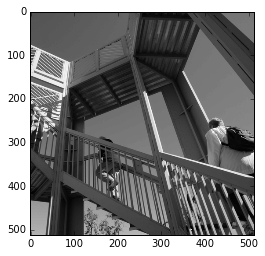
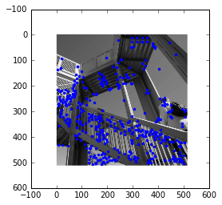
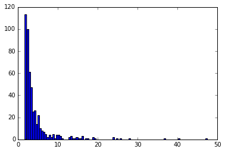
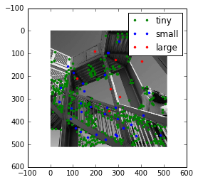
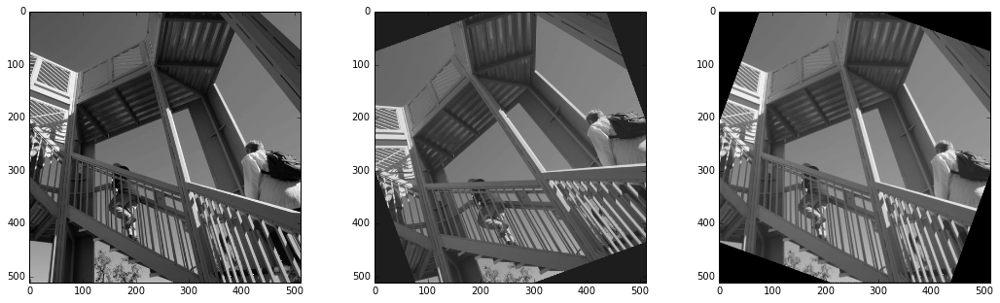

SIFT image alignment tutorial
=============================

SIFT (Scale-Invariant Feature Transform) is an algorithm developped by
David Lowe in 1999. It is a worldwide reference for image alignment and
object recognition. The robustness of this method enables to detect
features at different scales, angles and illumination of a scene. Silx
provides an implementation of SIFT in OpenCL, meaning that it can run on
Graphics Processing Units and Central Processing Units as well. Interest
points are detected in the image, then data structures called
*descriptors* are built to be characteristic of the scene, so that two
different images of the same scene have similar descriptors. They are
robust to transformations like translation, rotation, rescaling and
illumination change, which make SIFT interesting for image stitching. In
the fist stage, descriptors are computed from the input images. Then,
they are compared to determine the geometric transformation to apply in
order to align the images. This implementation can run on most graphic
cards and CPU, making it usable on many setups. OpenCL processes are
handled from Python with PyOpenCL, a module to access OpenCL parallel
computation API.

This tutorial explains the three subsequent steps:

-  keypoint extraction
-  Keypoint matching
-  image alignment

All the tutorial has been made using the Jupyter notebook.

.. code:: python

    %pylab inline

.. parsed-literal::

    Populating the interactive namespace from numpy and matplotlib

.. code:: python

    # display test image
    import scipy.misc
    image = scipy.misc.ascent()
    imshow(image, cmap="gray")

.. parsed-literal::

    <matplotlib.image.AxesImage at 0x7f6e8be189e8>

.. code:: python

    #Initialization of the sift object is time consuming: it compiles all the code.
    import os 
    os.environ["PYOPENCL_COMPILER_OUTPUT"] = "0" #set to 1 to see the compilation going on
    from silx.image import sift
    %time sift_ocl = sift.SiftPlan(template=image, devicetype="CPU") #switch to GPU to test your graphics card

.. parsed-literal::

    CPU times: user 560 ms, sys: 60 ms, total: 620 ms
    Wall time: 475 ms

.. parsed-literal::

    /scisoft/users/jupyter/jupy34/lib/python3.4/site-packages/pyopencl/__init__.py:207: CompilerWarning: Non-empty compiler output encountered. Set the environment variable PYOPENCL_COMPILER_OUTPUT=1 to see more.
      "to see more.", CompilerWarning)

.. code:: python

    print("Time for calculating the keypoints on one image of size %sx%s"%image.shape)
    %time keypoints = sift_ocl(image)
    print("Number of keypoints: %s"%len(keypoints))
    print("Keypoint content:")
    print(keypoints.dtype)
    print("x: %.3f \t y: %.3f \t sigma: %.3f \t angle: %.3f" % 
          (keypoints[-1].x,keypoints[-1].y,keypoints[-1].scale,keypoints[-1].angle))
    print("descriptor:")
    print(keypoints[-1].desc)

.. parsed-literal::

    Time for calculating the keypoints on one image of size 512x512
    CPU times: user 1.49 s, sys: 140 ms, total: 1.63 s
    Wall time: 860 ms
    Number of keypoints: 491
    Keypoint content:
    (numpy.record, [('x', '<f4'), ('y', '<f4'), ('scale', '<f4'), ('angle', '<f4'), ('desc', 'u1', (128,))])
    x: 287.611 	 y: 127.560 	 sigma: 47.461 	 angle: 0.503
    descriptor:
    [  0   0   0   0   0   0   0   0  13   0   0   5   3   0   0   2  49  12
       5   0   0   0   5  27   1   3   7   0   0   0   3   4   0   7  13  24
      40   0   0   0  61  11   4  72 127   3   0   8 127  92  34   3   7   0
       2  54  22  48  52   0   0   7  14  18   0  33 111 101 127   6   0   0
      33 127  37  64 127  11   0   4 125 127  91  17   5   0   7  54  20   8
      10  12   9  37  50  39   0   2  14  30 127  97   5   0  53  40   6  25
     119  58  15  54  58  30  17  13   7   7  12  67   0   0   2  21  36  25
       4   1]

.. code:: python

    #Overlay keypoints on the image:
    imshow(image, cmap="gray")
    plot(keypoints[:].x, keypoints[:].y,".")

.. parsed-literal::

    [<matplotlib.lines.Line2D at 0x7f6ecdd796d8>]

.. code:: python

    #Diplaying keypoints by scale:
    hist(keypoints[:].scale, 100)
    xlabel("scale")

.. parsed-literal::

    <matplotlib.text.Text at 0x7f6ea287e128>

.. code:: python

    #One can see 3 groups of keypoints, boundaries at: 8 and 20. Let's display them using colors.
    S = 8
    L = 20
    tiny = keypoints[keypoints[:].scale<S]
    small = keypoints[numpy.logical_and(keypoints[:].scale<L,keypoints[:].scale>=S)]
    bigger = keypoints[keypoints[:].scale>=L]
    imshow(image, cmap="gray")
    plot(tiny[:].x, tiny[:].y,".g", label="tiny")
    plot(small[:].x, small[:].y,".b", label="small")
    plot(bigger[:].x, bigger[:].y,".r", label="large")
    legend()

.. parsed-literal::

    <matplotlib.legend.Legend at 0x7f6e34672da0>

Image matching and alignment
----------------------------

Matching can also be performed on the device (GPU) as every single
keypoint from an image needs to be compared with all keypoints from the
second image.

In this simple example we will simple offset the first image by a few
pixels

.. code:: python

    shifted = numpy.zeros_like(image)
    shifted[5:,8:] = image[:-5, :-8]
    shifted_points = sift_ocl(shifted)

.. code:: python

    %time mp = sift.MatchPlan()
    %time match = mp(keypoints, shifted_points)
    print("Number of Keypoints with for image 1 : %i, For image 2 : %i, Matching keypoints: %i" % (keypoints.size, shifted_points.size, match.shape[0]))
    from numpy import median
    print("Measured offsets dx: %.3f, dy: %.3f"%(median(match[:,1].x-match[:,0].x),median(match[:,1].y-match[:,0].y)))

.. parsed-literal::

    CPU times: user 28 ms, sys: 0 ns, total: 28 ms
    Wall time: 24.9 ms
    CPU times: user 76 ms, sys: 20 ms, total: 96 ms
    Wall time: 22.5 ms
    Number of Keypoints with for image 1 : 491, For image 2 : 489, Matching keypoints: 424
    Measured offsets dx: 8.000, dy: 5.000

.. parsed-literal::

    /scisoft/users/jupyter/jupy34/lib/python3.4/site-packages/pyopencl/__init__.py:207: CompilerWarning: Non-empty compiler output encountered. Set the environment variable PYOPENCL_COMPILER_OUTPUT=1 to see more.
      "to see more.", CompilerWarning)

.. code:: python

    # Example of usage of the automatic alignment:
    import scipy.ndimage
    rotated = scipy.ndimage.rotate(image, 20, reshape=False)
    sa = sift.LinearAlign(image)
    figure(figsize=(18,5))
    subplot(1,3,1)
    imshow(image, cmap="gray")
    subplot(1,3,2)
    imshow(rotated,cmap="gray")
    subplot(1,3,3)
    imshow(sa.align(rotated), cmap="gray")

.. parsed-literal::

    /scisoft/users/jupyter/jupy34/lib/python3.4/site-packages/pyopencl/__init__.py:207: CompilerWarning: Non-empty compiler output encountered. Set the environment variable PYOPENCL_COMPILER_OUTPUT=1 to see more.
      "to see more.", CompilerWarning)

.. parsed-literal::

    <matplotlib.image.AxesImage at 0x7f6e22502588>

References
~~~~~~~~~~

-  David G. Lowe, Distinctive image features from scale-invariant
   keypoints, International Journal of Computer Vision, vol. 60, no 2,
   2004, p. 91–110 - "http://www.cs.ubc.ca/~lowe/papers/ijcv04.pdf"
