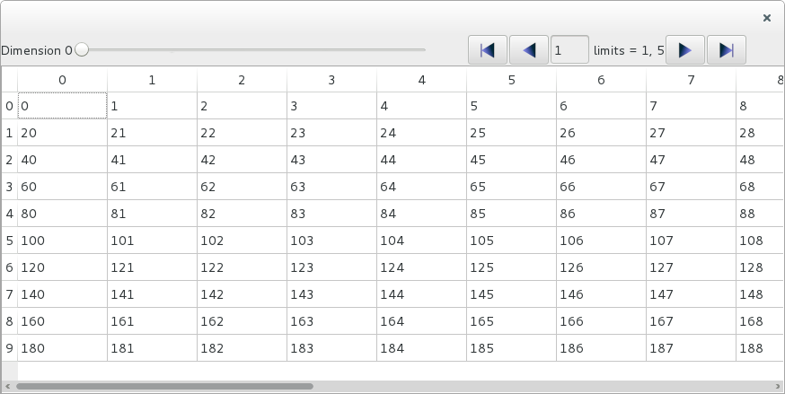
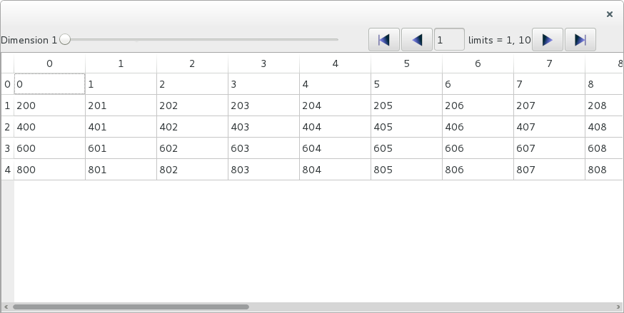
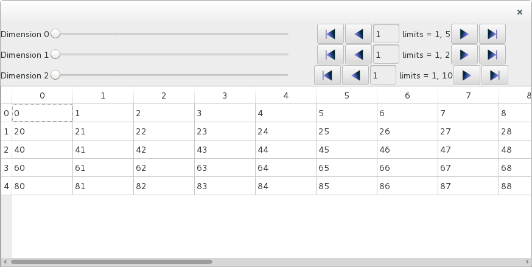
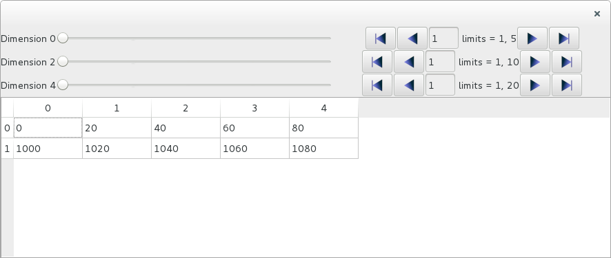

.. currentmodule:: silx.gui.data.ArrayTableWidget

ArrayTableWidget
================

:class:`ArrayTableWidget` is a widget designed to visualize numpy arrays or h5py
datasets.

3D example
----------

Let's look at a simple usage example:

.. code-block:: python

    from silx.gui import qt
    from silx.gui.data.ArrayTableWidget import ArrayTableWidget
    import numpy
    array = numpy.arange(1000)
    array.shape = (5, 10, 20)
    app = qt.QApplication([])
    w = ArrayTableWidget()
    w.setArrayData(array, labels=True)
    w.show()
    app.exec_()

|imgArray0|

We get a widget that allows us to see a *slice*, or a *frame*, of 2D data
with 10 lines and 20 columns, in a 3D array (5 x 10 x 20).
The column index corresponds to the last dimension of the array, and the
row index corresponds to the second to last dimension. The first index can be browsed
using a slider, icons or a text entry for access to any given slice among the 5 available.

The parameter ``labels=True`` of :meth:`setArrayData` causes the browser to be labeled
*Dimension 0*.

If we want to see slices in different perspective, we can use
:meth:`ArrayTableWidget.setPerspective`. The perspective is defined as the list
of dimensions that are not represented in the frame, orthogonal to it.
For a 3D array, there are 3 possible perspectives: *[0, ]* (the default perspective),
*[1, ]* and *[2, ]*.

Lets change the perspective:

.. code-block:: python

    w.setPerspective([1])

|imgArray1|

What we see now is a frame of *5 x 20* values, and the browser now browses the second dimension
to select one of 10 available frames. The label is updated accordingly to show *Dimension 1*.

To select a different frame programmatically, without using the browser, you can
use the :meth:`ArrayTableWidget.setIndex` method. To select the 9-th frame, use:

.. code-block:: python

    w.setIndex([8])

More dimensions
---------------

This widget can be used for arrays with any numbers of dimensions. Let's create
a 5-dimensional array and display it:

.. code-block:: python

    array = numpy.arange(10000)
    array.shape = (5, 2, 10, 5, 20)
    w.setArrayData(array, labels=True)

|imgArray2|

We now have 3 frames browsers, one for each one of the orthogonal dimensions.

Let's look at a frame whose axes are along the second
and the fourth dimension, by setting the orthogonal axes to the first,
third and fifth dimensions:

.. code-block:: python

   w.setPerspective([0, 2, 4])

|imgArray3|

Listing all the orthogonal dimensions might not feel very convenient for arrays
with more than 3 or 4 dimensions.
Fortunately, you can use the opposite approach of defining the two axes
parallel to the frame, using :meth:`ArrayTableWidget.setFrameAxes`:

.. code-block:: python

   w.setFrameAxes(row_axis=1, col_axis=3)

This achieves the exact same result as ``w.setPerspective([0, 2, 4])``.

.. note::

    Currently you cannot switch the row and column axes. The row axis
    is always the lowest free dimension and the column axis is the
    highest one with the current implementation.
    So setting ``w.setFrameAxes(row_axis=3, col_axis=1)`` would not modify
    the table axes.

    For the same reason, the order of the dimensions given as parameter to
    :meth:`setPerspective` is not significant.

To select a frame programmaticaly, you can again use :meth:`setFrameIndex`.
This time you must provide 3 unique indices:

.. code-block:: python

    w.setIndex([2, 5, 14])

The 3 indices relate to the first, third and fifth dimensions.

The frame index must always be defined as indices on the orthogonal axes/dimensions,
as defined by the *perspective*.

Editing the data
----------------

By default, the data displayed in the table view can be edited. If you modify
a cell with a valid value, it will be modified in the internal data model.

You can get the modified data with the following line:

.. code-block:: python

    newdata = w.getData()

This will give you a copy of the data, by default.

If you want the data to be read-only, not editable, you must specify it when
you set the data:

.. code-block:: python

    w.setDataArray(array, editable=False)

More performances
-----------------

By default, the method :meth:`setArrayData` creates a copy of the data array
for internal storage. This ensures that the original data object is not
modified when a cell of the table is changed interactively in the widget.

This behavior has a negative impact on performances, especially for large data arrays.
To avoid this, you can explicitly disable the copy operation when setting the data:

.. code-block:: python

    w.setArrayData(array, copy=False)

The internal data array used by the widget is then a reference
to the same data object as the original *array*. The memory is shared and
is not duplicated.

.. warning::

    This can cause side-effects, if your original array is re-used elsewhere
    in your program.

Similarly, you can pass *copy=False* to the :meth:`getData` method, to avoid
doing a data copy operation:

.. code-block:: python

    newdata = w.getData(copy=False)

The variable *newdata* is then a reference to the internal widget data.

.. warning::

    Modifying the internal data used by the widget can have unpredictable
    consequences.

Background color
----------------

You can set the background color for each cell by passing a numpy array of
RGB colors to the :meth:`setArrayColors` method.

The colors array must have one more dimension than the data array. This dimension
must be of length 3 for RGB colors or length 4 for RGBA colors.

The colors array associates 3 (or 4) integers between 0 and 255 to each value
in the data array. The values represent the red, green, blue and alpha (opacity)
channels.

In the following examples, we create a table displaying a complete palette
of RGB colors.

.. code-block:: python

   import numpy
   from silx.gui import qt
   from silx.gui.widgets.ArrayTableWidget import ArrayTableWidget

   # data array
   data = numpy.arange(256**3)
   data.shape = 256, 256, 256

   # RGB colors array
   bcolors = numpy.empty((256, 256, 256, 3), dtype=numpy.uint8)
   # fill red channel
   bcolors[..., 0] = data[:] & 255
   # green
   bcolors[..., 1] = (data[:] & (255 << 8)) >> 8
   # blue
   bcolors[..., 2] = (data[:] & (255 << 16)) >> 16

   # make text contrast with background (XOR)
   fcolors = numpy.bitwise_xor(bcolors, 255)

   app = qt.QApplication([])

   atw = ArrayTableWidget()
   atw.setArrayData(data, copy=False)
   atw.setArrayColors(bgcolors=bcolors,
                      fgcolors=fcolors)
   atw.show()

   app.exec_()

