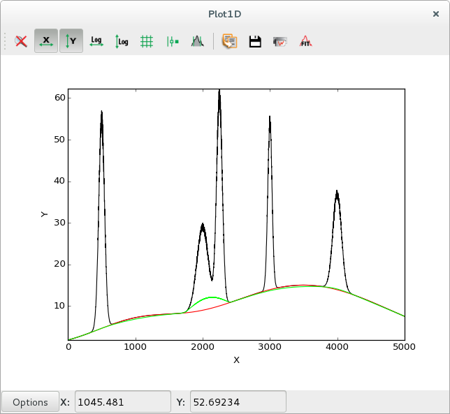
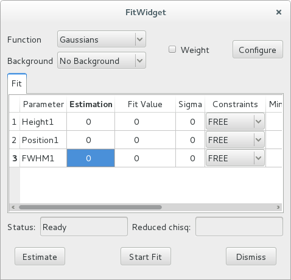
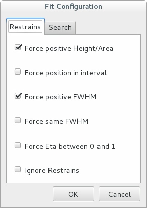
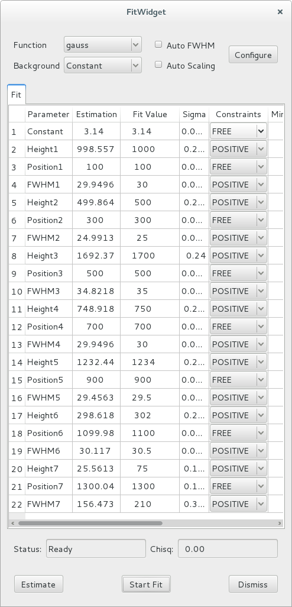
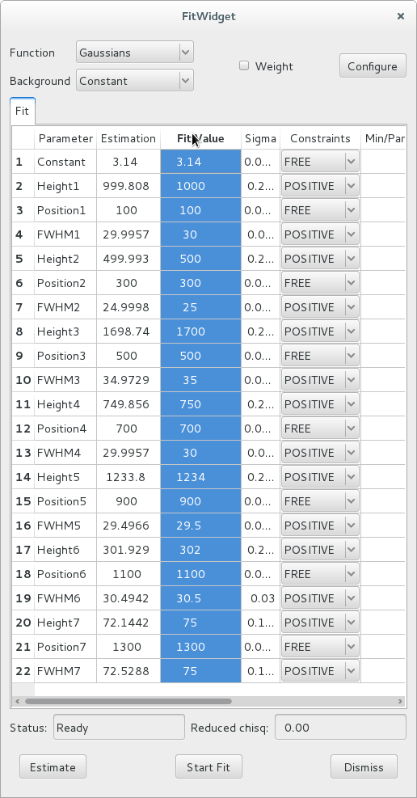
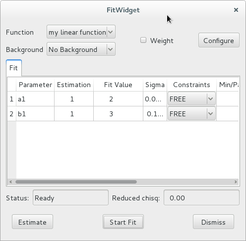

.. _fit-tutorial:

Best fit tools
--------------

.. contents:: :local:

.. _leastsq-tutorial:

Using :func:`leastsq`
+++++++++++++++++++++

.. currentmodule:: silx.math.fit

Running an iterative best fit process with :func:`leastsq` involves the following steps:

    - designing a fit model function having the signature ``f(x, ...)``,
      where ``x`` is an array of values of the independent variable and all
      remaining parameters are the parameters to be fitted
    - defining the sequence of initial values for all parameters to be fitted.
      You can usually start with ``[1., 1., ...]`` if you don't have a better
      estimate. The algorithm is robust enough to converge to a solution most
      of the times.
    - setting constraints (optional)

Data required to perform a fit is:

    - an array of ``x`` values (abscissa, independent variable)
    - an array of ``y`` data points
    - the ``sigma`` array of uncertainties associated to each data point.
      This is optional, by default each data point is assigned a weight of 1.

Default (unweighted) fit
************************

Let's demonstrate this process in a short example, using synthetic data.
We generate an array of synthetic data using a polynomial function of degree 4,
and try to use :func:`leastsq` to find back the function parameters.

.. code-block:: python

   import numpy
   from silx.math.fit import leastsq

   # create some synthetic polynomial data
   x = numpy.arange(1000)
   y = 2.4 * x**4 - 10. * x**3 + 15.2 * x**2 - 24.6 * x + 150.

   # define our fit function: a generic polynomial of degree 4
   def poly4(x, a, b, c, d, e):
       return a * x**4 + b * x**3 + c * x**2 + d * x + e

   # The fit is an iterative process that requires an initial
   # estimation of the parameters. Let's just use 1s.
   initial_parameters = numpy.array([1., 1., 1., 1., 1.])

   # Run fit
   fitresult = leastsq(model=poly4,
                       xdata=x,
                       ydata=y,
                       p0=initial_parameters,
                       full_output=True)

   # leastsq with full_output=True returns 3 objets
   optimal_parameters, covariance, infodict = fitresult
   # the first object is an array with the fitted parameters
   a, b, c, d, e = optimal_parameters

   print("Fit took %d iterations" % infodict["niter"])
   print("Reduced chi-square: %f" % infodict["reduced_chisq"])
   print("Theoretical parameters:\n\t" +
         "a=2.4, b=-10, c=15.2, d=-24.6, e=150")
   print("Optimal parameters for y2 fitting:\n\t" +
         "a=%f, b=%f, c=%f, d=%f, e=%f" % (a, b, c, d, e))

The output of the above program is::

   Fit took 35 iterations
   Reduced chi-square: 682592.670690
   Theoretical parameters:
       a=2.4, b=-10, c=15.2, d=-24.6, e=150
   Optimal parameters for y fitting:
       a=2.400000, b=-9.999665, c=14.970422, d=31.683448, e=-3216.131136

.. note::

    The exact results may vary depending on your Python version.

We can see that the fitting result is poor. In particular, parameters ``d`` and ``e``
are very poorly fitted.

This is due to the fact that data points with large values have a stronger influence
in the fitting process. In our examples, as ``x`` increases, ``y`` increases fast.
The influence of the weighting and how to solve this issue is explained in more details
in the next section.

In the meantime, if you simply limit the ``x`` range to deal with
smaller ``y`` values, you can notice that the fit result becomes perfect.

In our example, replacing ``x`` by::

    x = numpy.arange(100)

produces the following result::

   Fit took 9 iterations
   Reduced chi-square: 0.000000
   Theoretical parameters:
       a=2.4, b=-10, c=15.2, d=-24.6, e=150
   Optimal parameters for y fitting:
       a=2.400000, b=-10.000000, c=15.200000, d=-24.600000, e=150.000000

Weighted fit
************

Since the fitting algorithm minimizes the sum of squared differences between input
and calculated data, points with higher y values have a greater weight in the fitting process.
A way to improve the fit, is to attach uncertainties to the data.
The larger the uncertainty on a data sample, the smaller its weight in the least-square problem.

It is important to set the uncertainties correctly, or you risk to introduce a bias either
toward the lower values or toward the higher values in your data.

The common approach in event counting experiments is to use the squareroot of the data
values as the uncertainty values (assuming a Poissonian law).
Let's apply it to the previous example:

.. code-block:: python

   sigma = numpy.sqrt(y)

   # Fit y
   fitresult = leastsq(model=poly4,
                       xdata=x,
                       ydata=y,
                       sigma=sigma,
                       p0=initial_parameters,
                       full_output=True)

This results in a great improvement::

   Weighted fit took 6 iterations
   Reduced chi-square: 0.000000
   Theoretical parameters:
       a=2.4, b=-10, c=15.2, d=-24.6, e=150
   Optimal parameters for y fitting:
       a=2.400000, b=-10.000000, c=15.200000, d=-24.600000, e=150.000000

The resulting fit is perfect. The fit converged even faster than when
we limited the ``x`` range to 0 -- 100.

To use a real world example, when fitting x-ray fluorescence spectroscopy data,
this common approach means that we take the variance of each channel to be
the number of counts in that channel.
That corresponds to assuming a normal distribution.
The true distribution being a Poisson distribution, the Gaussian distribution
is a good approximation for channels with high number of counts,
but the approximation is not valid when the number of counts in a channel is low.

Therefore, in spectra where the overall statistics is very low, a
weighted fit can lead the fitting process to fit the background
considering the peaks as outliers, because the fit procedure will consider a
channel with 1 count has a 100 times higher weight than a channel with 100 counts.

Constrained fit
***************

Let's revert to our unweighted fit and try out with different approaches for improving the fit.

The :func:`leastsq` function provides
a way to set constraints on parameters. You can for instance enforce that a given
parameter must remain equal to its initial value, or define an acceptable range
for it to vary, or decide that a parameter must be equal to another parameter
multiplied by a certain factor. This is very useful for cases in which you have
enough knowledge to make reasonable assumptions on some parameters.

In our case, we will set constraints on ``d`` and ``e``. We will require ``d`` to
stay in the range between -25 and -24, and fix ``e`` to 150.

Replace the call to :func:`leastsq` by the following lines:

.. code-block:: python

   # Define constraints
   cons = [[0, 0, 0],          # a: no constraint
           [0, 0, 0],          # b: no constraint
           [0, 0, 0],          # c: no constraint
           [2, -25., -23.],    # -25 < d < -24
           [3, 0, 0]]          # e is fixed to initial value
   fitresult = leastsq(poly4, x, y,
                       # initial values must be consistent with constraints
                       p0=[1., 1., 1., -24., 150.],
                       constraints=cons,
                       full_output=True)

The output of this program is::

   Constrained fit took 100 iterations
   Reduced chi-square: 3.749280
   Theoretical parameters:
       a=2.4, b=-10, c=15.2, d=-24.6, e=150
   Optimal parameters for y fitting:
       a=2.400000, b=-9.999999, c=15.199648, d=-24.533014, e=150.000000

The chi-square value is substantially improved and the results are much better, at the
cost of more iterations.

.. _fitmanager-tutorial:

Using :class:`FitManager`
+++++++++++++++++++++++++

.. currentmodule:: silx.math.fit.fitmanager

A :class:`FitManager` is a tool that provides a way of handling fit functions,
associating estimation functions to estimate the initial parameters, modify
the configuration parameters for the fit (enabling or disabling weights...) or
for the estimation function, and choosing a background model.

It provides an abstraction layer on top of :func:`leastsq`.

Weighted polynomial fit
***********************

The following program accomplishes the same weighted fit of a polynomial as in
the previous tutorial (See `Weighted fit`_)

.. code-block:: python

    import numpy
    from silx.math.fit.fitmanager import FitManager

    # Create synthetic data with a sum of gaussian functions
    x = numpy.arange(1000).astype(numpy.float)
    y = 2.4 * x**4 - 10. * x**3 + 15.2 * x**2 - 24.6 * x + 150.

    # define our fit function: a generic polynomial of degree 4
    def poly4(x, a, b, c, d, e):
        return a * x**4 + b * x**3 + c * x**2 + d * x + e

    # define an estimation function to that returns initial parameters
    # and constraints
    def esti(x, y):
        p0 = numpy.array([1., 1., 1., 1., 1.])
        cons = numpy.zeros(shape=(5, 3))
        return p0, cons

    # Fitting
    fit = FitManager()
    fit.setdata(x=x, y=y)

    fit.addtheory("polynomial",
                  function=poly4,
                  # any list of 5 parameter names would be OK
                  parameters=["A", "B", "C", "D", "E"],
                  estimate=esti)
    fit.settheory('polynomial')
    fit.configure(WeightFlag=True)
    fit.estimate()
    fit.runfit()

    print("\n\nFit took %d iterations" % fit.niter)
    print("Reduced chi-square: %f" % fit.chisq)
    print("Theoretical parameters:\n\t" +
          "a=2.4, b=-10, c=15.2, d=-24.6, e=150")
    a, b, c, d, e = (param['fitresult'] for param in fit.fit_results)
    print("Optimal parameters for y2 fitting:\n\t" +
          "a=%f, b=%f, c=%f, d=%f, e=%f" % (a, b, c, d, e))

The result is the same as in the weighted :func:`leastsq` example,
as expected::

    Fit took 6 iterations
    Reduced chi-square: 0.000000
    Theoretical parameters:
        a=2.4, b=-10, c=15.2, d=-24.6, e=150
    Optimal parameters for y2 fitting:
        a=2.400000, b=-10.000000, c=15.200000, d=-24.600000, e=150.000000

Fitting Gaussians
*****************

The :class:`FitManager` object is especially useful for fitting multi-peak
Gaussian-shaped spectra. The *silx* module :mod:`silx.math.fit.fittheories`
contains fit functions and their associated estimation functions that are
specifically designed for this purpose.

These fit functions can handle a varying number of parameters defining a
variable number of peaks, and the estimation functions use a peak detection
algorithm to determine how many initial parameters must be returned.

For the sake of example, let's test the multi-peak fitting on synthetic
data, generated using another *silx* module: :mod:`silx.math.fit.functions`.

.. code-block:: python

    import numpy
    from silx.math.fit.functions import sum_gauss
    from silx.math.fit import fittheories
    from silx.math.fit.fitmanager import FitManager

    # Create synthetic data with a sum of gaussian functions
    x = numpy.arange(1000).astype(numpy.float)

    # height, center x, fwhm
    p = [1000, 100., 250,     # 1st peak
         255, 690., 45,       # 2nd peak
         1500, 800.5, 95]     # 3rd peak

    y = sum_gauss(x, *p)

    # Fitting
    fit = FitManager()
    fit.setdata(x=x, y=y)
    fit.loadtheories(fittheories)
    fit.settheory('Gaussians')
    fit.estimate()
    fit.runfit()

    print("Searched parameters = %s" % p)
    print("Obtained parameters : ")
    dummy_list = []
    for param in fit.fit_results:
        print(param['name'], ' = ', param['fitresult'])
        dummy_list.append(param['fitresult'])
    print("chisq = ", fit.chisq)

The result of this program is::

    Searched parameters = [1000, 100.0, 250, 255, 690.0, 45, 1500, 800.5, 95]
    Obtained parameters :
    ('Height1', ' = ', 1000.0)
    ('Position1', ' = ', 100.0)
    ('FWHM1', ' = ', 250.0)
    ('Height2', ' = ', 255.0)
    ('Position2', ' = ', 690.0)
    ('FWHM2', ' = ', 44.999999999999993)
    ('Height3', ' = ', 1500.0)
    ('Position3', ' = ', 800.5)
    ('FWHM3', ' = ', 95.000000000000014)
    ('chisq = ', 0.0)

In addition to Gaussians, we could have fitted several other similar types of
function: asymmetric Gaussian functions, Lorentzian functions,
pseudo-voigt functions or hypermet tailing functions.

The :meth:`loadtheories` method can also be used to load user defined
functions. Instead of a module, a path to a Python source file can be given
as a parameter. This source file must adhere to certain conventions, as explained
in the documentation of :mod:`silx.math.fit.fittheories` and
:mod:`silx.math.fit.fittheory.FitTheory`.

Background subtraction
**********************

:class:`FitManager` provides a few standard background theories, for cases when
a background signal is superimposed on the multi-peak spectrum.

For instance, let's add a linear background to our synthetic data, and see how
:class:`FitManager` handles the fitting.

In our previous example, redefine ``y`` as follows:

.. code-block:: python

    p = [1000, 100., 250,
         255, 690., 45,
         1500, 800.5, 95]
    y = sum_gauss(x, *p)
    # add a synthetic linear background
    y += 0.13 * x + 100.

Before the line ``fit.estimate()``, add the following line:

.. code-block:: python

    fit.setbackground('Linear')

The result becomes::

    Searched parameters = [1000, 100.0, 250, 255, 690.0, 45, 1500, 800.5, 95]
    Obtained parameters :
    ('Constant', ' = ', 100.00000000000001)
    ('Slope', ' = ', 0.12999999999999998)
    ('Height1', ' = ', 1000.0)
    ('Position1', ' = ', 100.0)
    ('FWHM1', ' = ', 249.99999999999997)
    ('Height2', ' = ', 255.00000000000003)
    ('Position2', ' = ', 690.0)
    ('FWHM2', ' = ', 44.999999999999993)
    ('Height3', ' = ', 1500.0)
    ('Position3', ' = ', 800.5)
    ('FWHM3', ' = ', 95.0)
    ('chisq = ', 3.1789004676997597e-27)

The available background theories are: *Linear*, *Constant* and *Strip*.

The strip background is a popular background model that can compute and
subtract any background shape as long as its curvature is significantly
lower than the peaks' curvature. In other words, as long as the background
signal is significantly smoother than the actual signal, it can be easily
computed.

The main parameters required by the strip function are the strip width *w*
and the number of iterations. At each iteration, if the content of channel *i*,
``y(i)`` is above the average of the contents of the channels at a distance *w*
(measured in channel units) i.e., ``y(i-w)`` and ``y(i+w)``,
``y(i)`` is replaced by the average value of the neighbouring channels.
At the end of the process one is left with something that resembles a spectrum
in which the peaks have been "stripped".

The following example illustrates the strip background removal process:

.. code-block:: python

    from silx.sx import plot
    from silx.gui import qt
    import numpy
    from silx.math.fit.filters import strip
    from silx.math.fit.functions import sum_gauss

    x = numpy.arange(5000)
    # (height1, center1, fwhm1, ...) 5 peaks
    params1 = (50, 500, 100,
               20, 2000, 200,
               50, 2250, 100,
               40, 3000, 75,
               23, 4000, 150)
    y0 = sum_gauss(x, *params1)

    # random values between [-1;1]
    noise = 2 * numpy.random.random(5000) - 1
    # make it +- 5%
    noise *= 0.05

    # 2 gaussians with very large fwhm, as background signal
    actual_bg = sum_gauss(x, 15, 3500, 3000, 5, 1000, 1500)

    # Add 5% random noise to gaussians and add background
    y = y0 * (1 + noise) + actual_bg

    # compute strip background model
    strip_bg = strip(y, w=5, niterations=5000)

    # plot results
    app = qt.QApplication([])
    plot(x, y, x, actual_bg, x, strip_bg)
    plot(x, y, x, (y - strip_bg))
    app.exec_()

.. |imgStrip2| image:: img/stripbg_plot2.png
   :height: 300px
   :align: middle

.. list-table::
   :widths: 1 2

   * - |imgStrip1|
     - Data with background in black (``y``), actual background in red, computed strip
       background in green
   * - |imgStrip2|
     - Data with background in blue, data after subtracting the strip background in black

The strip also removes the statistical noise, so the computed strip background
will be slightly lower than the actual background. This can be solved by
smoothing the data prior to the strip computation.

See the `PyMca documentation <http://pymca.sourceforge.net/stripbackground.html>`_
for more information on the strip background.

To configure the strip background model of :class:`FitManager`, use its :meth:`configure`
method to modify the following parameters:

 - *StripWidth*: strip width parameter *w*, mentioned earlier
 - *StripNIterations*: number of iterations
 - *StripThresholdFactor*: if this parameter is left to its default value 1,
   the algorithm behaves as explained earlier: ``y(i)`` is compared to the average of
   ``y(i-1)`` and ``y(i+1)``.
   If this factor is set to another value, *f*, ``y(i)`` is compared to the
   average multiplied by *f*.
 - *SmoothStrip*: if this parameter is set to ``True``, smoothing is performed
   prior to stripping.

These parameters can be modified like this:

.. code-block:: python

    # ...
    fit.settheory('Strip')
    fit.configure(StripWidth=5,
                  StripNIterations=5000,
                  StripThresholdFactor=1.1,
                  SmoothStrip=True)
    # ...

Using a strip background has performance implications. You should try to keep
the number of iterations as low as possible if you need to run batch fitting
using this model. Increasing the strip width can help reducing the number of
iterations, with the risk of underestimating the background signal.

.. _fitwidget-tutorial:

Using :class:`FitWidget`
++++++++++++++++++++++++

.. currentmodule:: silx.gui.fit.FitWidget

Simple usage
************

:class:`FitWidget` is a graphical interface to :class:`FitManager`.

.. code-block:: python

    import numpy
    from silx.gui import qt
    from silx.gui.fit import FitWidget
    from silx.math.fit.functions import sum_gauss

    x = numpy.arange(2000).astype(numpy.float)
    constant_bg = 3.14

    # gaussian parameters: height, position, fwhm
    p = numpy.array([1000, 100., 30.0,
                     500, 300., 25.,
                     1700, 500., 35.,
                     750, 700., 30.0,
                     1234, 900., 29.5,
                     302, 1100., 30.5,
                     75, 1300., 75.])
    y = sum_gauss(x, *p) + constant_bg

    a = qt.QApplication([])

    w = FitWidget()
    w.setData(x=x, y=y)
    w.show()

    a.exec_()

Executing this code opens the following widget.

    |imgFitWidget1|

The functions you can choose from the widget are the standard Gaussian-shaped functions
from :mod:`silx.math.fit.fittheories`. At the top of the list, you will find
the *Add Function(s)* option, that allows loading the user defined fit
theories from a *.py* source file.

After selecting the *Constant* background model and clicking the *Estimate*
button, the widget displays this:

    |imgFitWidget2|

7 peaks have been detected, and their parameters estimated.
Also, the estimation function defines some constraints (positive height and full-width at half-maximum).

You can modify the values in the estimation column of the table, to use different
initial fit parameters.

The individual constraints can be modified prior to fitting. It is also possible to
modify the constraints globally by clicking the *Configure* button to open a
configuration dialog. To get help on the meaning of the various parameters,
hover the mouse cursor on the corresponding check box or entry widget to display a
tooltip help message.

    |imgFitWidget3|

The other configuration tabs can be modified to change the peak search parameters
and the strip background parameters prior to estimating them.
After closing the configuration dialog, you must re-run the estimation
by clicking the *Estimate* button.

After all configuration parameters and all constraints are set according to your
preferences, you can click the *Start Fit* button. This runs the fit and displays
the results in the *Fit Value* column of the table.

    |imgFitWidget4|

Customising the functions
*************************

The :class:`FitWidget` can be initialised with a non-standard
:class:`FitManager` to customise the available functions.

.. code-block:: python

    from silx.gui import qt
    from silx.math.fit import FitManager
    from silx.gui.fit import FitWidget

    def linearfun(x, a, b):
        return a * x + b

    # create synthetic data for the example
    x = list(range(0, 100))
    y = [linearfun(x_, 2.0, 3.0) for x_ in x]

    # we need to create a custom fit manager and add our theory
    myfitmngr = FitManager()
    myfitmngr.setdata(x, y)
    myfitmngr.addtheory("my linear function",
                        function=linearfun,
                        parameters=["a", "b"])

    a = qt.QApplication([])

    # our fit widget can now use our custom fit manager
    fw = FitWidget(fitmngr=myfitmngr)
    fw.show()

    a.exec_()

In our previous example, we didn't load a customised :class:`FitManager`,
therefore, the fit widget automatically initialised the default fit manager and
loaded the default custom Gaussian functions.

This time, we initialised our own :class:`FitManager` and loaded our
own function, so only this function is presented as an option in the GUI.

Our custom function does not provide an associated estimation function, so
the default estimation function of the :class:`FitManager` is used. This
default estimation function returns an array of ones with the same length as the
list of *parameter* names, and sets all constraints to *FREE*.

    |imgFitWidget5|
