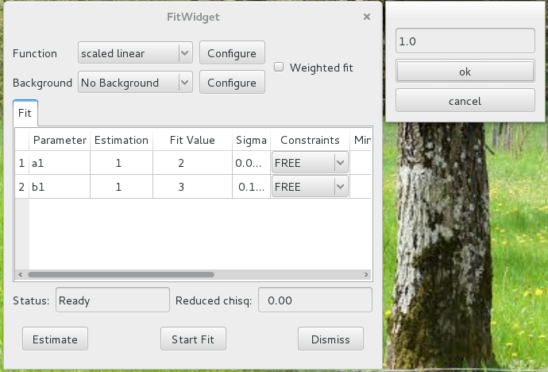
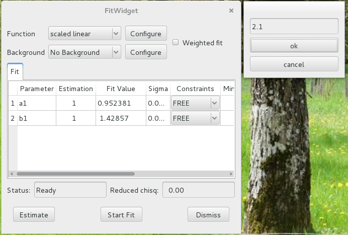
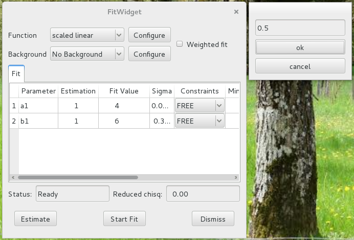

Custom fit configuration widgets
================================

The *silx* fit widget allows users to add custom fit theories.
A fit theory consists of several components, such as the model function
to be fitted, an estimation function...

One of these component is the optional custom configuration widget.
This is the dialog widget that is opened when a user clicks the *Configure*
button next to the drop-down list used to select the fit theory or the
background theory.

This tutorial explains how to define your own fit configuration widget
for your custom fit theories.

Prerequisites
--------------

This tutorial assumes that you are already familiar with
the standard features of :class:`silx.gui.fit.FitWidget`.
See the :ref:`fitwidget-tutorial` tutorial.

You should also be familiar with adding custom fit theories.

You will find documentation about these subjects by clicking the following links:

    - :class:`silx.math.fit.fitmanager` (methods `addtheory` and `addbgtheories`)
    - :class:`silx.math.fit.fittheory`
    - :class:`silx.math.fit.fittheories`
    - :class:`silx.math.fit.bgtheories`

The widgets we will create in this tutorial are based on the PyQt library.
Some knowledge of *PyQt* is desirable.

Basic concepts
--------------

Modal window
++++++++++++

A fit configuration widget should be a modal dialog window, so that
when a user opens the dialog to modify the configuration, the rest of
the program is frozen until all the configuration parameters are properly
defined. The program usually resumes when the user clicks the *Ok* or the
*Cancel* button in the dialog.

The widget must implement a number of methods and attributes to be used as a
dialog by FitWidget:

    - standard *QDialog* methods:

        - :meth:`show`: should cause the widget to become visible to the
          user)
        - :meth:`exec_`: should run while the user is interacting with the
          widget, interrupting the rest of the program. It should
          typically end (*return*) when the user clicks an *OK*
          or a *Cancel* button.
        - :meth:`result`: must return ``True`` if the new configuration
          is to be accepted (*OK* clicked) or ``False`` if it should be
          rejected (*Cancel* clicked)

    - an additional *output* attribute, a dictionary storing configuration parameters
      to be interpreted by the corresponding fit theory.

    - an optional *setDefault* method to initialize the
      widget values with values in a dictionary passed as a parameter.
      This will be executed first.

The first 3 methods can be automatically defined by inheriting :class:`QDialog`.

Associate a dialog to a theory
++++++++++++++++++++++++++++++

After defining a custom dialog widget, it must be initialized and associated
with a theory.

A fit theory in :class:`FitWidget` is defined by a name. For example,
one of the default theories is named *"Gaussians"*.
So if you define a configuration dialog :class:`MyGaussianConfigWidget` to define
configuration parameters understood by this theory, you can associate it the following
way.

.. code-block:: python

            fw = FitWidget()
            my_config_widget = MyGaussianConfigWidget(parent=fw)
            fw.associateConfigDialog(theory_name="Gaussians",
                                     config_widget=my_config_widget)

Example
-------

The following example defines a very basic configuration dialog widget
with a simple text entry in which the user can type in a floating point value.

The value is simply saved in a dictionary attribute
:attr:`CustomConfigWidget.output`. *FitWidget* will look-up this dictionary
and pass it to the theory's custom configuration function, :func:`fitconfig`.
The configuration function essentially updates the :const:`CONFIG` dictionary
used by our fit function to scale the *y* values.

.. code-block:: python

    from silx.gui import qt
    from silx.gui.fit import FitWidget
    from silx.math.fit.fittheory import FitTheory
    from silx.math.fit.fitmanager import FitManager

    app = qt.QApplication([])

    # default fit configuration
    CONFIG = {"scale": 1.0}

    # define custom fit config dialog
    class CustomConfigWidget(qt.QDialog):
        def __init__(self):
            qt.QDialog.__init__(self)
            self.setModal(True)
            self.scalingFactorEdit = qt.QLineEdit(self)
            self.scalingFactorEdit.setToolTip(
                "Enter the scaling factor"
            )
            self.scalingFactorEdit.setValidator(qt.QDoubleValidator(self))

            self.ok = qt.QPushButton("ok", self)
            self.ok.clicked.connect(self.accept)
            cancel = qt.QPushButton("cancel", self)
            cancel.clicked.connect(self.reject)

            layout = qt.QVBoxLayout(self)
            layout.addWidget(self.scalingFactorEdit)
            layout.addWidget(self.ok)
            layout.addWidget(cancel)

            self.old_scale = CONFIG["scale"]
            self.output = {}

        def accept(self):
            self.output["scale"] = float(self.scalingFactorEdit.text())
            qt.QDialog.accept(self)

        def reject(self):
            self.output["scale"] = self.old_scale
            qt.QDialog.reject(self)

    # our actual fit model function
    def fitfun(x, a, b):
        return CONFIG["scale"] * (a * x + b)

    # fit configuration
    def fitconfig(scale=None, **kw):
        """Update global config dict CONFIG"""
        if scale is not None:
            CONFIG["scale"] = scale
        return CONFIG

    # synthetic test data a=2, b=3
    x = list(range(0, 100))
    y = [fitfun(x_, 2, 3) for x_ in x]

    # register our custom fit theory
    fitmngr = FitManager()
    fitmngr.setdata(x, y)
    fitmngr.addtheory("scaled linear",
                      FitTheory(
                          function=fitfun,
                          parameters=["a", "b"],
                          configure=fitconfig))

    # open a fitwidget and associate an instance of our custom
    # configuration dialog to our custom theory
    fw = FitWidget(fitmngr=fitmngr)
    fw.associateConfigDialog("scaled linear", CustomConfigWidget())
    fw.show()

    app.exec_()

.. list-table::
   :widths: 1 4
   :header-rows: 1

   * - Screenshot
     - Description
   * - |img0|
     - If the default value of 1.0 is used, the fit finds *a=2* and *b=3*
       as expected.
   * - |img1|
     - Setting a scaling factor of 2.1 causes the fit to find results that are
       less than about half of the normal expected result.
   * - |img2|
     - A scaling factor of 0.5 causes the fit to find the values to be double
       of the ones used for generating the synthetic data.
