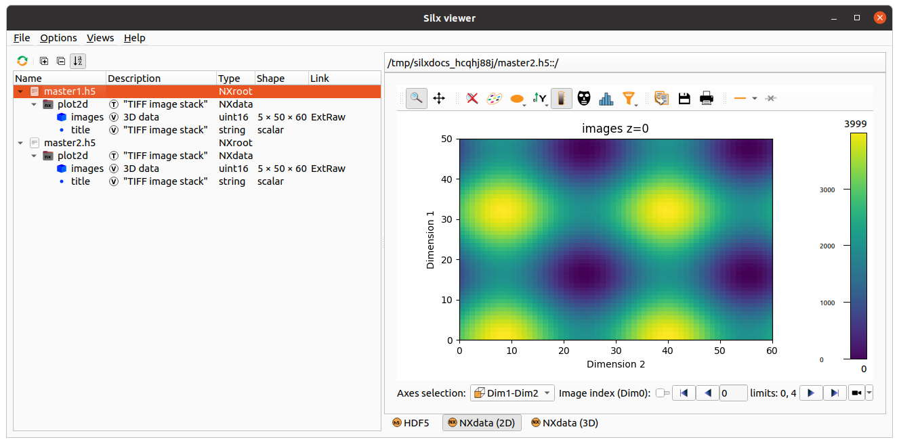

.. _create-hdf5-content-from-a-schema:

Create HDF5 content from a schema
=================================

The hierarchical content of an HDF5 file can be represented as a Python :code:`dict` instance.

The function :func:`silx.io.dictdump.dicttonx` has the following convention for keys and values
to represent HDF5 concepts:

.. list-table::
   :widths: 1 1 1
   :header-rows: 1

   * - Schema key
     - Value type
     - HDF5 meaning
   * - 
     - * :code:`dict`
     - `Group <https://docs.h5py.org/en/stable/high/group.html>`_
   * - 
     - * any except :code:`dict`
       * e.g. number, string, list, numpy array
     - `Dataset <https://docs.h5py.org/en/stable/high/dataset.html>`_
   * - * starting with ``@`` or containing ``@``
       * :code:`tuple(<item-name>, <attr-name>)`
     - * e.g. number, string, list, numpy array
     - `Attribute <https://docs.h5py.org/en/stable/high/attr.html>`_
   * - starting with ``>``
     - * :code:`str`
       * :class:`silx.io.url.DataUrl`
       * :code:`h5py.SoftLink`
     - `Soft link <https://docs.h5py.org/en/stable/high/group.html#group-softlinks>`_
   * - starting with ``>``
     - * :code:`str`
       * :class:`silx.io.url.DataUrl`
       * :code:`h5py.ExternalLink`
     - `External link <https://docs.h5py.org/en/stable/high/group.html#external-links>`_
   * - starting with ``>``
     - * :code:`str`
       * :code:`list[str]`
       * :class:`silx.io.url.DataUrl`
       * :code:`list[silx.io.url.DataUrl]`
       * :code:`h5py.VirtualLayout`
       * :code:`dict` with ``dictdump_schema="virtual_dataset_v1"``
     - `Virtual dataset <https://docs.h5py.org/en/stable/vds.html>`_
   * - starting with ``>``
     - * :code:`str`
       * :code:`list[str]`
       * :class:`silx.io.url.DataUrl`
       * :code:`list[silx.io.url.DataUrl]`
       * :code:`dict` with ``dictdump_schema="external_binary_link_v1"``
     - `External binary dataset <https://docs.h5py.org/en/stable/high/dataset.html#h5py.Dataset.external>`_

The :func:`silx.io.dictdump.dicttoh5` function does not parse special key characters or value schema's
but requires explicit data types for the different types of HDF5 concepts:

.. list-table::
   :widths: 1 1 1
   :header-rows: 1

   * - Schema key
     - Value type
     - HDF5 meaning
   * - 
     - :code:`dict`
     - `Group <https://docs.h5py.org/en/stable/high/group.html>`_
   * - 
     - * any except :code:`dict`
       * e.g. number, string, list, numpy array
     - `Dataset <https://docs.h5py.org/en/stable/high/dataset.html>`_
   * - :code:`tuple(<item-name>, <attr-name>)`
     - * e.g. number, string, list, numpy array
     - `Attribute <https://docs.h5py.org/en/stable/high/attr.html>`_
   * - 
     - :class:`h5py.SoftLink`
     - `Soft link <https://docs.h5py.org/en/stable/high/group.html#group-softlinks>`_
   * - 
     - :class:`h5py.ExternalLink`
     - `External link <https://docs.h5py.org/en/stable/high/group.html#external-links>`_
   * - 
     - :class:`h5py.VirtualLayout`
     - `Virtual dataset <https://docs.h5py.org/en/stable/vds.html>`_
   * - 
     - :class:`silx.io.dictdumplink.ExternalBinaryLink`
     - `External binary dataset <https://docs.h5py.org/en/stable/high/dataset.html#h5py.Dataset.external>`_

Common Usage
------------

:download:`This example <../../../examples/hdf5fromschema.py>`
uses a schema describing groups, datasets, attributes, soft links, external links and virtual datasets.

.. code-block:: python

    x = numpy.arange(110) / 50
    y = numpy.random.uniform(size=110)

    data = {
        "@NX_class": "NXroot",  # HDF5 attribute
        "@default": "entry",
        "entry": {
            "@NX_class": "NXentry",
            "@default": "process",
            "process": {
                "@NX_class": "NXprocess",
                "@default": "plot2d",
                "description": "Dark-current subtraction",
                "software_name": "MyReductionPipeline",
                "version": "1.0",
                "parameters": {
                    "@NX_class": "NXparameters",
                    "dark_current_level": 42.0,
                    "threshold": 100,
                },
                "data": {
                    "@NX_class": "NXcollection",
                    ">x": "./raw_data.h5::/1.1/instrument/positioners/samy",  # HDF5 external link
                    "y": y,
                },
                "plot1d": {
                    ">y": "../data/y",  # HDF5 soft link
                    ">x": "../data/x",
                    "@signal": "y",
                    "@axes": "x",
                    "@NX_class": "NXdata",
                    "title": "Dark-current subtracted",
                },
                "plot2d": {
                    ">y": {  # HDF5 virtual dataset
                        "dictdump_schema": "virtual_dataset_v1",
                        "shape": (10, 11),
                        "dtype": float,
                        "sources": [
                            {"data_path": "../data/y", "shape": (110,), "dtype": float},
                        ],
                    },
                    "@signal": "y",
                    "@NX_class": "NXdata",
                    "title": "Dark-current subtracted",
                },
            },
        },
    }

    raw_filename = os.path.join(tmpdir, "raw_data.h5")
    processed_filename = os.path.join(tmpdir, "processed_data.h5")

    with h5py.File(processed_filename, "a") as h5file:
        dicttonx(
            treedict=data,
            h5file=h5file,
            h5path="/",
            update_mode="replace",
            add_nx_class=True,
        )

    with h5py.File(raw_filename, "w") as h5file:
        h5file["/1.1/instrument/positioners/samy"] = x

Attributes
----------

Attributes of groups and datasets can be defined with a key `"<item-name>@<attr-name>"`
or alternatively for groups `"@<attr-name>"`. In this example we mix both notations:

.. code-block:: python

    data = {
        "@NX_class": "NXroot",
        "entry@NX_class": "NXentry",
        "entry": {
            "distance": [0, 1, 2],
            "distance@units": "mm",
        },
    }

Soft and External Links
-----------------------

The target of a soft link is a group or dataset in the same file than the link itself. The target of an external link
is a group or dataset in another file than the link itself. 

In the example we used this soft link

.. code-block:: python

    "data": {"y": y},
    "plot1d": {">y": "../data/y"}

There are all equivalent ways of defining the same soft link

.. code-block:: python

    "plot1d": {">y": ".::/entry/process/data/y"}
    "plot1d": {">y": "processed_data.h5::/entry/process/data/y"}
    "plot1d": {">y": "/tmp/processed_data.h5::/entry/process/data/y"}

.. note::

  When using `"."` as file name it means "the same file as the link itself".
  The soft link is always created relative to the link `when possible`.

Instead of a :code:`str` the value can also be an instance of :code:`silx.io.url.DataUrl`. Internally every string
is converted to a :code:`DataUrl` instance so any format supported by :code:`DataUrl` can be used.

When the file path in the URL refers to another file, an external link is created. In the example we used

.. code-block:: python

    "data": {">x": "./raw_data.h5::/1.1/instrument/positioners/samy"}

.. note::

  The file name of the external link is always converted to a file name relative to the link.
  The data path portion of the URL must always be absolute in the case.

Virtual Datasets
----------------

Virtual datasets allow merging, slicing and reshaping other datasets in the same file or external files.

:download:`This example <../../../examples/hdf5fromschema_vds.py>` uses a list of URL's to be stacked
in one 3D dataset while selecting an image ROI of :code:`[20:30,40:50]`:

.. code-block:: python

    ">images_roi": [
      "data0.h5?path=/group/dataset&slice=:,20:30,40:50",
      "data1.h5?path=/group/dataset&slice=:,20:30,40:50",
      "data2.h5?path=/group/dataset&slice=:,20:30,40:50"
    ]

.. warning::

  When defining a virtual dataset with a list of URL's, the source files will be opened and inspected.
  In addition there is no flexibility in the way the sources are merged together.

Here is an equivalent schema that does not open the source files and allows defining
the way the sources are merged together:

.. code-block:: python

    ">images_roi": {
      "dictdump_schema": "virtual_dataset_v1",
      "dtype": dtype("uint16"),
      "shape": (15, 10, 10),
      "sources": [
        {
          "data_path": "/group/dataset",
          "dtype": dtype("uint16"),
          "file_path": "data0.h5",
          "shape": (5, 50, 60),
          "source_index": (
            slice(None, None, None),
            slice(20, 30, None),
            slice(40, 50, None)
          ),
          "target_index": slice(0, 5, None)
        },
        {
          "data_path": "/group/dataset",
          "dtype": dtype("uint16"),
          "file_path": "data1.h5",
          "shape": (5, 50, 60),
          "source_index": (
            slice(None, None, None),
            slice(20, 30, None),
            slice(40, 50, None)
          ),
          "target_index": slice(5, 10, None)
        },
        {
          "data_path": "/group/dataset",
          "dtype": dtype("uint16"),
          "file_path": "data2.h5",
          "shape": (5, 50, 60),
          "source_index": (
            slice(None, None, None),
            slice(20, 30, None),
            slice(40, 50, None)
          ),
          "target_index": slice(10, 15, None)
        }
      ]
    }

External Binary Data
--------------------

External binary data can be concatenated as a dataset.

:download:`This example <../../../examples/hdf5fromschema_tiff.py>` uses a list of TIFF files to be concatenated
in one 3D dataset:

.. code-block:: python

    ">images": ["data0.tiff", "data1.tiff", "data2.tiff", "data4.tiff", "data5.tiff"]

.. warning::

  When defining a virtual dataset with a list of filenames, the source files will be opened and inspected.
  In addition the HDF5 dataset will store absolute file names so moving the data will break the link.

Here is an equivalent schema that can be used for any binary data which is contiguous and uncompressed:

.. code-block:: python

    ">images": {
        "dictdump_schema": "external_binary_link_v1",
        "dtype": numpy.uint16,
        "shape": (5, 50, 60),
        "sources": [
            ("data0.tiff", 196, 6000),
            ("data1.tiff", 196, 6000),
            ("data2.tiff", 196, 6000),
            ("data3.tiff", 196, 6000),
            ("data4.tiff", 196, 6000),
        ],
    }
