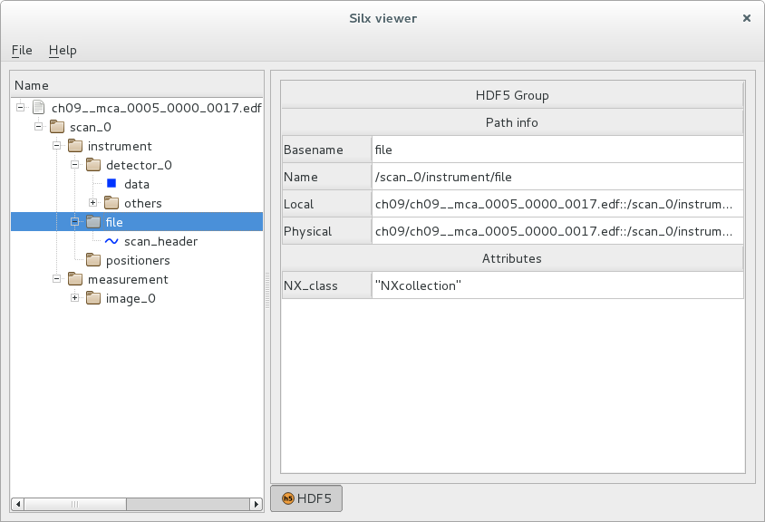

Getting started with silx.io
============================

This tutorial explains how to read data files using the :meth:`silx.io.open` function.

The target audience are developers without knowledge of the *h5py* library.

If you are already familiar with *h5py*, you just need to know that
the :meth:`silx.io.open` function returns objects that mimic *h5py* file objects,
and that the main supported file formats are:

  - HDF5
  - all formats supported by the *FabIO* library
  - SPEC data files

Knowledge about the python *dictionary* type and the numpy *ndarray* type
are prerequisites for this tutorial.

Background
----------

In the past, it was necessary to learn how to use multiple libraries to read multiple
data formats. The library *FabIO* was designed to read in images in many formats, but not to read in
more heterogeneous formats, such as *HDF5* or *SPEC*.

To read *SPEC* data files in Python, a common solution was to use the *PyMca* module
:mod:`PyMca5.PyMcaIO.specfilewrapper`.
Regarding HDF5 files, the de-facto standard for reading them in Python is the *h5py* library.

*silx* tries to provide a unified way to read all data formats supported at the ESRF.
Today, HDF5 is the preferred format to store data for many scientific institutions, including most synchrotrons.
Hence, it was decided to provide tools for reading data that mimic the *h5py* library's API.

Definitions
-----------

HDF5
++++

The *HDF5* format is a *hierarchical data format*, designed to store and
organise large amounts of data.

An HDF5 file contains a number of *datasets*, which are multidimensional arrays
of a homogeneous type.

These datasets are stored in container structures
called *groups*. Groups can also be stored in other groups, allowing to
define a hierarchical tree structure.

Both datasets and groups may have *attributes* attached to them. Attributes are
used to document an object. Attributes are similar to datasets in several respects
(data containers of homogeneous type), but there sizes are typically much smaller
than the object data themselves.

It is quite common to compare an HDF5 file to a filesystem.
Groups are analogous to directories, while datasets are analogous to files,
and attributes are analogous to file metadata (creation date, last modification...).

h5py
++++

The *h5py* library is a pythonic interface to the `HDF5`_ binary data format.

It exposes an HDF5 group as a python object that resembles a python
dictionary and an HDF5 dataset or attribute as an object that resembles a
numpy array.

API description
---------------

All main objects, i.e., File, Group and Dataset, share the following attributes:

 - :attr:`attrs`: Attributes, as a dictionary of metadata for the group or dataset.
 - :attr:`basename`: String giving the basename of this group or dataset.
 - :attr:`name`: String giving the full path to this group or dataset, relative
   to the root group (file).
 - :attr:`file`: File object at the root of the tree structure containing this
   group or dataset.
 - :attr:`parent`: Group object containing this group or dataset.

File object
+++++++++++

The API of the file objects returned by the :meth:`silx.io.open`
function tries to be as close as possible to the API of the :class:`h5py.File`
objects used to read HDF5 data.

An h5py file is a group with just a few extra attributes and methods.

The objects defined in `silx.io` implement a subset of these attributes and methods:

 - :attr:`filename`: Name of the file on disk.
 - :attr:`mode`: String indicating whether the file is open in read mode ("r")
   or write mode ("w"). :meth:`silx.io.open` always returns objects in read mode.
 - :meth:`close`: Close this file. All child objects, groups and datasets, will become invalid.

The :attr:`parent` of a file is `None`, and its :attr:`name` is an empty string.

Group object
++++++++++++

Group objects behave like python dictionaries.

One can iterate over group's :meth:`keys`, that are the names of the objects
encapsulated by the group (datasets and sub-groups). The :meth:`values` method
returns an iterator over the encapsulated objects. The :meth:`items` method returns
an iterator over `(name, value)` pairs.

Groups provide a :meth:`get` method that retrieves an item, or information about an item.
Like standard python dictionaries, a `default` parameter can be used to specify
a value to be returned if the given name is not a member of the group.

Two methods are provided to visit recursively all members of a group, :meth:`visit`
and :meth:`visititems`. The former takes as argument a *callable* with the signature
``callable(name) -> None or return value``. The latter  takes as argument a *callable*
with the signature ``callable(name, object) -> None or return value`` (``object`` being a
a group or dataset instance.)

Example
-------

Accessing data
++++++++++++++

In this first example below, we open a Spec data file and print some pieces of its information.

.. code-block:: python

    >>> import silx.io
    >>> sf = silx.io.open("data/CuZnO_2.spec")
    <silx.io.spech5.SpecH5 at 0x7f00d0760f90>
    >>> print(sf.keys())
    ['1.1', '2.1', '3.1', '4.1', '5.1', '6.1', '7.1', ...]
    >>> print(sf["1.1"])
    <silx.io.spech5.ScanGroup object at 0x7f00d0715b90>

We opened a file, keeping a reference to the file object as ``sf``.
We then printed all items contained in the root group. We can see that all
these items are groups. Let us look at what is inside these groups, and find
datasets:

.. code-block:: python

    >>> grp = sf["2.1"]
    ... for name in grp:
    ...     item = grp[name]
    ...     print("Found item " + name)
    ...     if silx.io.is_dataset(item):
    ...         print("'%s' is a dataset.\n" % name)
    ...     elif silx.io.is_group(item):
    ...         print("'%s' is a group.\n" % name)
    ...
    Found item title
    title is a dataset.

    Found item start_time
    start_time is a dataset.

    Found item instrument
    instrument is a group.

    Found item measurement
    measurement is a group.

    Found item sample
    sample is a group.

We could have replaced the first three lines by the following single line,
using the iterator returned by the group method :meth:`items`:

.. code-block:: python

    >>> for name, item in sf["2.1"].items():
    ...

In addition to :meth:`silx.io.is_group` and :meth:`silx.io.is_dataset`,
you can also use :meth:`silx.io.is_file` and :meth:`silx.io.is_softlink`.

Let's look at a dataset:

.. code-block:: python

    >>> print(sf["2.1/title"])
    <HDF5-like dataset "title": shape (), type "|S29">

As you can see, printing a dataset does not print the data itself, it only print a
representation of the dataset object. The printed information tells that the
object is similar to a numpy array, with a *shape* and a *type*.

In this case, we are dealing with a scalar dataset, so we can use the same syntax as
in numpy to access the scalar value, ``result = dset[()]``:

.. code-block:: python

    >>> print(sf["2.1/title"][()])
    2  ascan  phi 0.61 1.61  20 1

Similarly, you need to use numpy slicing to access values in a numeric array:

.. code-block:: python

    >>> print (sf["2.1/measurement/Phi"])
    <HDF5-like dataset "Phi": shape (21,), type "<f4">
    >>> print (sf["2.1/measurement/Phi"][0:10])
    [ 0.61000001  0.66000003  0.70999998  0.75999999  0.81        0.86000001
      0.91000003  0.95999998  1.00999999  1.05999994]
    >>> entire_phi_array = sf["2.1/measurement/Phi"][:]

Here we could read the entire array by slicing it with ``[:]``, because we know
it is a 1D array. For a 2D array, the slicing argument would be ``[:, :]``.

For a dataset of unknown dimensionality (including scalar datasets), the
``Ellipsis`` object (represented by ``...``) can be used to slice the object.

.. code-block:: python

    >>> print(sf["2.1/title"][...])
    2  ascan  phi 0.61 1.61  20 1
    >>> print (sf["2.1/measurement/Phi"][...])
    [ 0.61000001  0.66000003  0.70999998  0.75999999  0.81        0.86000001
      0.91000003  0.95999998  1.00999999  1.05999994  1.11000001  1.15999997
      1.21000004  1.25999999  1.30999994  1.36000001  1.40999997  1.46000004
      1.50999999  1.55999994  1.61000001]

To read more about the usage of ``Ellipsis`` to slice arrays, see
`"Indexing numpy arrays" <http://scipy-cookbook.readthedocs.io/items/Indexing.html?highlight=indexing#Multidimensional-slices>`_
in the scipy documentation.

Note that slicing a scalar dataset via ``[()]`` is not strictly equivalent to
slicing via ``[...]``. The former returns the actual scalar value in
the dataset, while the latter always returns an array object, which happens to
be 0D in the case of a scalar.

    >>> sf["2.1/instrument/positioners/Delta"][()]
    0.0
    >>> sf["2.1/instrument/positioners/Delta"][...]
    array(0.0, dtype=float32)

Closing the file
++++++++++++++++

You should always make sure to close the files that you opened. The simplest way of
closing a file is to call its :meth:`close` method.

.. code-block:: python

    import silx.io
    sf = silx.io.open("data/CuZnO_2.spec")

    # read the information you need...
    maxPhi = sf["2.1/measurement/Phi"][...].max()

    sf.close()

The drawback of this method is that, if an error is arising while processing
the file, the program might never reach the ``sf.close()`` line.
Leaving files open can cause various issues to the rest of your program,
such as consuming memory, not being able to reopen the file when you need it...

The best way to ensure that the file is always properly closed is to use the file
inside its context manager:

.. code-block:: python

    import silx.io

    with silx.io.open("data/CuZnO_2.spec") as sf:
        # read the information you need...
        maxPhi = sf["2.1/measurement/Phi"][...].max()

Additional resources
--------------------

- `h5py documentation <http://docs.h5py.org/en/latest/>`_
- `Formats supported by FabIO <http://www.silx.org/doc/fabio/dev/getting_started.html#list-of-file-formats-that-fabio-can-read-and-write>`_
- `Spec file with h5py-like structure <http://www.silx.org/doc/silx/dev/modules/io/spech5.html#api-description>`_
- `HDF5 format documentation <https://support.hdfgroup.org/HDF5/>`_
