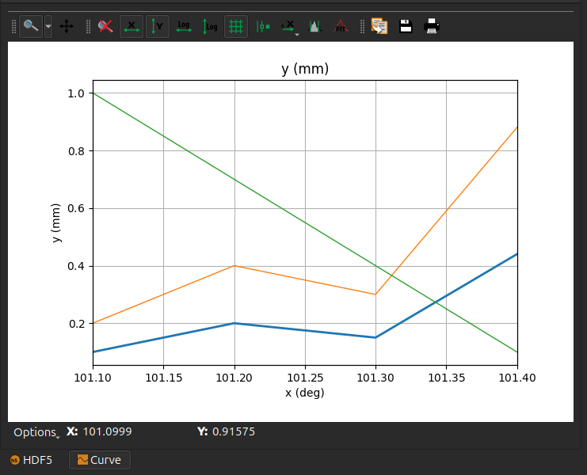
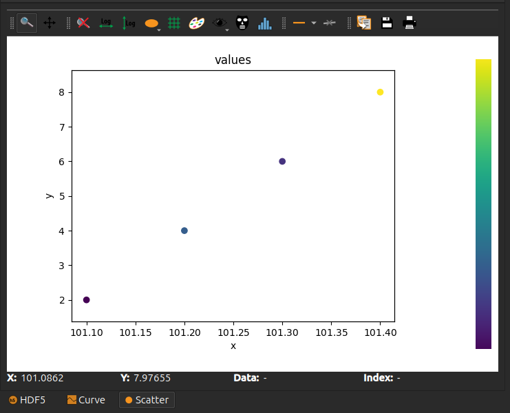
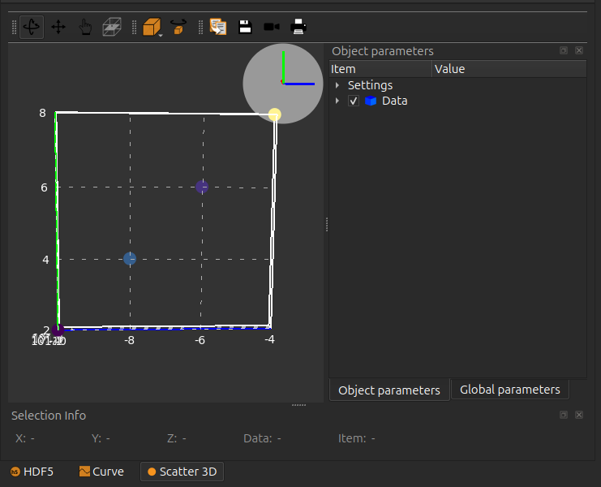
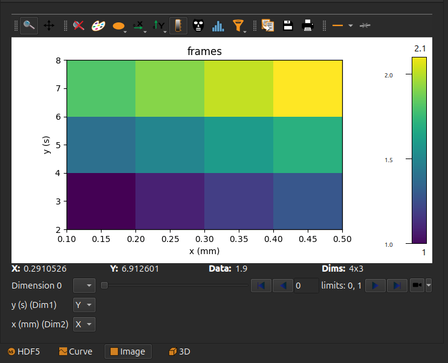

Writing NXdata
==============

This tutorial explains how to write a *NXdata* group into a HDF5 file.

A basic knowledge of the HDF5 file format, including understanding
the concepts of *group*, *dataset* and *attribute*,
is a prerequisite for this tutorial. You should also be able to read
a Python script using the *h5py* library to write HDF5 data.
You can find some information on these topics at the beginning of the
:doc:`io` tutorial.

Definitions
-----------

NeXus Data Format
+++++++++++++++++

NeXus is a common data format for neutron, x-ray, and muon science.
It is being developed as an international standard by scientists and programmers
representing major scientific facilities in order to facilitate greater
cooperation in the analysis and visualization of neutron, x-ray, and muon data.

It uses the HDF5 format, adding additional rules and structure to help
people and software understand how to read a data file.

The name of a group in a NeXus data file can be any string of characters,
but it must have a `NX_class` attribute defining a
`*class type* <http://download.nexusformat.org/doc/html/introduction.html#important-classes>`_.

Examples of such classes are:

 - *NXroot*: root group of the file (may be implicit, if the `NX_class` attribute is omitted)
 - *NXentry*: describes a measurement; it is mandatory that there is at least one
   group of this type in the NeXus file
 - *NXsample*: contains information pertaining to the sample, such as its chemical composition,
   mass, and environment variables (temperature, pressure, magnetic field, etc.)
 - *NXinstrument*: encapsulates all the instrumental information that might be relevant to a measurement
 - *NXdata*: describes the plottable data and related dimension scales

You can find all the specifications about the NeXus format on the
`nexusformat.org website <https://www.nexusformat.org/>`_. The rest of this tutorial will
focus exclusively on *NXdata*.

NXdata groups
+++++++++++++

NXdata describes the plottable data and related dimension scales.

It is mandatory that there is at least one NXdata group in each NXentry group.
Note that the variable and data can be defined with different names.
The `signal` and `axes` attributes of the group define which items
are plottable data and which are dimension scales, respectively.

In the case of a curve, for instance, you would have a 1D signal
dataset (*y* values) and optionally another 1D signal of identical
size as axis (*x* values). In the case of an image, you would have
a 2D dataset as signal and optionally two 1D datasets to scale
the X and Y axes.

A NXdata group should define all the information needed to
provide a sensible plot, including axis labels and a plot title.
It can also include additional metadata such as standard deviations
of data values, or errors an axes.

.. note::

    The NXdata specification evolved slightly over the course of time.
    The `complete documentation for the *NXdata* class
    <http://download.nexusformat.org/doc/html/classes/base_classes/NXdata.html>`_ mentions
    older rules that you will probably have to take into account
    if you intend to write a program that reads NeXus files.

    If you only need to write such files and only need to read back files
    you have yourself written, you should adhere to the most recent rules.
    We will only mention these most recent specifications in this tutorial.

Main elements in a NXdata group
-------------------------------

Signal
++++++

The `@signal` attribute of the NXdata group provides the name of a dataset
containing the plottable data. The name of this dataset can be freely chosen
by the writer.

This signal dataset may have a `@long_name` attribute, that can be used as
an axis label (e.g. for the Y axis of a curve) or a plot title (e.g. for an image).

Axes
++++

The `@axes` attributes of the NXdata group provides a list of names of datasets
to be used as *dimension scales*. The number of axes in this list
should match the number of dimensions of the signal data, in the general case.
But in some specific cases, such as scatter plots or stack of images or curves,
the number of axes may differ from the number of signal dimensions.

An axis should be a 1D dataset, whose length matches the size of the corresponding
signal dimension.

Silx supports also an axis being a dataset with 2 values :math:`(a, b)`.
In such a case, it is interpreted as an affine scaling of the indices
(:math:`i \mapsto a + i * b`).

An axis dataset may have a `@long_name` attribute, that can be used as
an axis label.

An axis dataset may also define a `@first_good` and `@last_good` attribute.
These can be used to define a range of indices to be considered valid values
in the axis.

The name of the dataset can be freely chosen by the writer.

An axis may be omitted for one or more dimensions of the signal. In this
case, a `"."` should be written in place of the dataset name in the
list of axes names.

Signal errors
+++++++++++++

A dataset named `errors` can be present in a NXdata group. It provides
the standard deviation of data values. This dataset must have the same
shape as the signal dataset.

Axes errors
+++++++++++

An axis may have associated errors (uncertainties). These axis errors
must be provided in a dataset whose name is the axis name with `_errors`
appended to it.

For instance, an axis whose dataset name is `pressure` may provide errors
in an another dataset whose name is `pressure_errors`.

This dataset must have the same size as the corresponding axis.

Interpretation
++++++++++++++

Silx supports an attribute `@interpretation` attached to the signal dataset.
The supported values for this attribute are `scalar`, `spectrum` or `image`.

This attribute must be provided when the number of axes is lower than the
number of signal dimensions. For instance, a 3D signal with
`@interpretation="image"` is interpreted as a stack of images.
The axes always apply to the last dimensions of the signal, so in this example
of a 3D stack of images, the first dimension is not scaled and is interpreted as
a *frame number*.

.. note::

   This attribute is documented in the official NeXus `description <https://manual.nexusformat.org/nxdl_desc.html>`_

Examples of NXdata with h5py
----------------------------

A curve
+++++++

The simplest NXdata example would be a 1D signal to be plotted as a curve.

.. code-block:: python

    import h5py
    import numpy

    with h5py.File("myfile.h5", "w") as h5file:
        # It is mandatory to have at least one NXentry
        # https://manual.nexusformat.org/classes/base_classes/NXentry.html#nxentry
        entry = h5file.create_group("entry")
        entry.attrs["NX_class"] = "NXentry"

        nxdata = entry.create_group("my_curve")
        nxdata.attrs["NX_class"] = "NXdata"
        nxdata.attrs["signal"] = "y"
        ds = nxdata.create_dataset("y", data=numpy.array([0.1, 0.2, 0.15, 0.44]))

        # Add units (optional)
        ds.attrs["units"] = "mm"

        # Add an axis (optional)
        nxdata.attrs["axes"] = ["x"]
        ds = nxdata.create_dataset("x", data=numpy.array([101.1, 101.2, 101.3, 101.4]))
        ds.attrs["units"] = "deg"

        # Add additional curves with auxiliary signals (optional)
        nxdata.create_dataset("y2", data=numpy.array([0.2, 0.4, 0.3, 0.88]))
        nxdata.create_dataset("y3", data=numpy.array([1, 0.7, 0.4, 0.1]))
        nxdata.attrs["auxiliary_signals"] = ["y2", "y3"]

This will give the following plot in ``silx view``:

A 2D scatter plot
+++++++++++++++++

A scatter plot is the only case for which we can have more axes than
there are signal dimensions. The signal is 1D, and there can be any
number of axes with the same number of values as the signal.

Silx supports 2D and 3D scatters.

To generate a 2D scatter plot:

.. code-block:: python

    import h5py
    import numpy

    with h5py.File("myfile.h5", "w") as h5file:
        entry = h5file.create_group("entry")
        entry.attrs["NX_class"] = "NXentry"

        nxdata = entry.create_group("my_scatter")
        nxdata.attrs["NX_class"] = "NXdata"
        nxdata.attrs["signal"] = "values"
        nxdata.attrs["axes"] = ["x", "y"]
        nxdata.create_dataset("values", data=numpy.array([0.1, 0.2, 0.15, 0.44]))
        nxdata.create_dataset("x", data=numpy.array([101.1, 101.2, 101.3, 101.4]))
        nxdata.create_dataset("y", data=numpy.array([2, 4, 6, 8]))

Again, in ``silx view``:

A 3D scatter plot
+++++++++++++++++

A 3D scatter plot can be generated likewise

.. code-block:: python

    import h5py
    import numpy

    with h5py.File("myfile.h5", "w") as h5file:
        entry = h5file.create_group("entry")
        entry.attrs["NX_class"] = "NXentry"

        nxdata = entry.create_group("my_3D_scatter")
        nxdata.attrs["NX_class"] = "NXdata"
        nxdata.attrs["signal"] = "values"
        nxdata.attrs["axes"] = ["x", "y", "z"]
        nxdata.create_dataset("values", data=numpy.array([0.1, 0.2, 0.15, 0.44]))
        nxdata.create_dataset("x", data=numpy.array([101.1, 101.2, 101.3, 101.4]))
        nxdata.create_dataset("y", data=numpy.array([2, 4, 6, 8]))
        nxdata.create_dataset("z", data=numpy.array([-10, -8, -6, -4]))

.. note:: 

    When producing the 3D scatter plot, ``silx view`` will scale the markers according to the first auxiliary signal.

    .. code-block:: python

        nxdata.create_dataset("sizes", data=numpy.array([2, 4, 4, 2]))
        nxdata.attrs["auxiliary_signals"] = ["sizes"]

    If there is no auxiliary signal, all markers will have the same size.

A stack of images
+++++++++++++++++

In case of a stack, the first axis corresponds to stack indices and may not be represented by a dataset.

In this case, we use ``.`` as a placeholder in ``axes`` for this dimension:

.. code-block:: python

    import h5py
    import numpy

    with h5py.File("myfile.h5", "w") as h5file:
        entry = h5file.create_group("entry")
        entry.attrs["NX_class"] = "NXentry"

        nxdata = entry.create_group("image")
        nxdata.attrs["NX_class"] = "NXdata"
        nxdata.attrs["signal"] = "frames"
        nxdata.attrs["axes"] = [".", "y", "x"]
        # 2 frames of size 3 rows x 4 columns
        signal = nxdata.create_dataset(
            "frames",
            data=numpy.array(
                [
                    [[1.0, 1.1, 1.2, 1.3], [1.4, 1.5, 1.6, 1.7], [1.8, 1.9, 2.0, 2.1]],
                    [[8.0, 8.1, 8.2, 8.3], [8.4, 8.5, 8.6, 8.7], [8.8, 8.9, 9.0, 9.1]],
                ]
            ),
        )
        x = nxdata.create_dataset("x", data=numpy.array([0.1, 0.2, 0.3, 0.4]))
        x.attrs["units"] = "mm"
        y = nxdata.create_dataset("y", data=numpy.array([2, 4, 6]))
        y.attrs["units"] = "s"

.. note:: 

    If the image axes have the same ``units`` or both have no ``units``, the image aspect ratio will kept.
    
    In the example above, the two axes ``x`` and ``y`` have different ``units`` so that the image aspect ratio is not conserved.