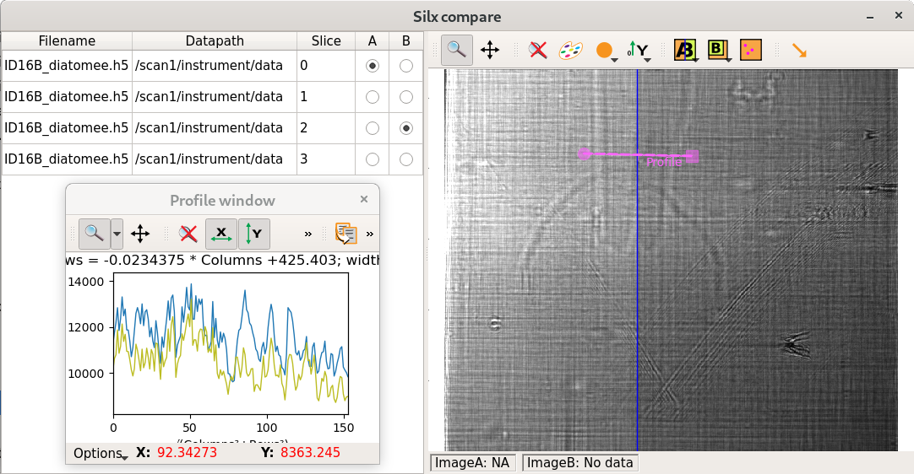

.. _silx compare:

silx compare
============

Purpose
-------

The *silx compare* command provides a graphical user interface to compare 2D data from files.

It displays a list of datasets, and allows to open multiple datasets.
This list can be updated with drag and drop from silx view.

Usage
-----

::

    silx compare [-h] [--debug] [--use-opengl-plot] [files [files ...]]

Options
-------

  -h, --help         show this help message and exit
  --debug            Set logging system in debug mode
  --use-opengl-plot  Use OpenGL for plots (instead of matplotlib)

Examples of usage
-----------------

::

    silx compare "silx://ID16B_diatomee.h5?path=/scan1/instrument/data&slice=0" "silx://ID16B_diatomee.h5?path=/scan1/instrument/data&slice=1"
