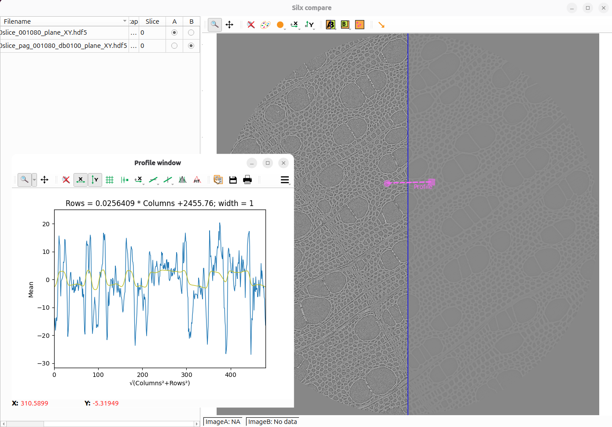

.. _silx-compare:

silx compare
============

Purpose
-------

The *silx compare* command provides a graphical user interface to compare 2D data from files.

This tool allows you to list land open multiple datasets.

Comparison Modes
----------------

Two selected datasets (labeled ``A`` and ``B``) can be compared using different visualization modes:

Vertical Compare Mode
"""""""""""""""""""""

Splits the display horizontally into two panels:

- Dataset ``A`` is displayed on the **left** side
- Dataset ``B`` is displayed on the **right** side

Horizontal Compare Mode
"""""""""""""""""""""""

Splits the display vertically into two panels: 

- Dataset ``A`` is displayed at the **top**
- Dataset ``B`` is displayed at the **bottom**

Color-Encoded Difference Modes
""""""""""""""""""""""""""""""

- **Blue/Red** — Color scheme highlighting positive/negative deviations
- **Yellow/Cyan** — Alternative to Blue/Red color mapping for difference visualization
- **Raw** — Unprocessed concatenated data without color encoding for direct inspection

More
----

You can add files by dragging and dropping them from ``silx view``.

  .. figure:: http://www.silx.org/doc/silx/img/silx_compare_drag_and_drop.gif
    :width: 300px
    :align: center

Usage
-----

::

    silx compare [-h] [--debug] [--use-opengl-plot] [files [files ...]]

Options
-------

  -h, --help         show this help message and exit
  --debug            Set logging system in debug mode
  --use-opengl-plot  Use OpenGL for plots (instead of matplotlib)

Examples of usage
-----------------

::

    silx compare "silx://ID16B_diatomee.h5?path=/scan1/instrument/data&slice=0" "silx://ID16B_diatomee.h5?path=/scan1/instrument/data&slice=1"
