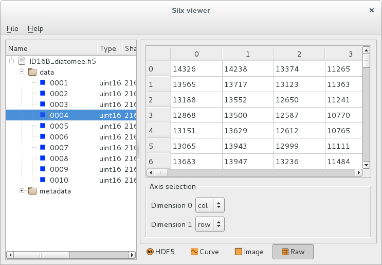
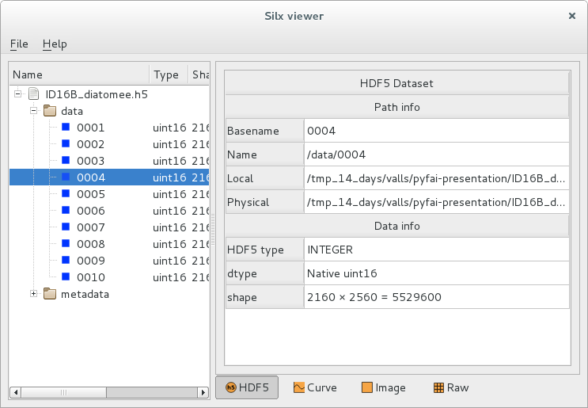

silx view
=========

Purpose
-------

The *silx view* command is provided to open data files
in a graphical user interface. It allows to select a particular
piece of data or a particular header in structured data formats,
and to view this data in plot widgets or in simple table views.

.. |imgViewImg| image:: img/silx-view-image.png
   :height: 300px
   :align: middle

.. list-table::
   :widths: 1 2

   * - |imgViewImg|
     - Image view
   * - |imgViewTable|
     - Viewing raw data as values in a table
   * - |imgViewHdf5|
     - Viewing metadata and HDF5 attributes

Usage
-----

::

    silx view [-h] [--debug] [--use-opengl-plot] [files [files ...]]

Options
-------

  -h, --help           Show this help message and exit
  --debug              Set logging system in debug mode
  --use-opengl-plot    Use OpenGL for plots (instead of matplotlib)

Examples of usage
-----------------

::

    silx view 31oct98.dat
    silx view *.edf
    silx view myfile.h5
