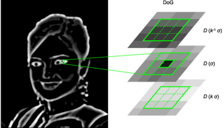
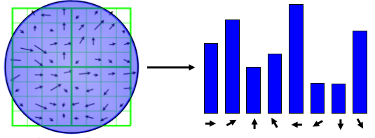
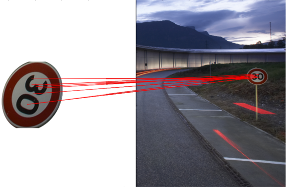
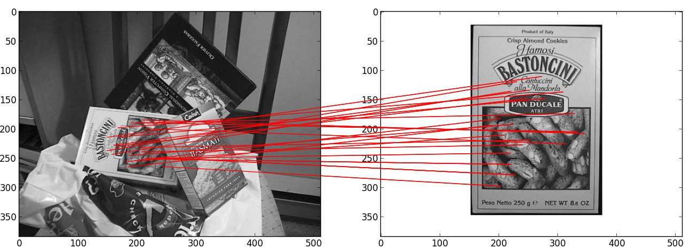
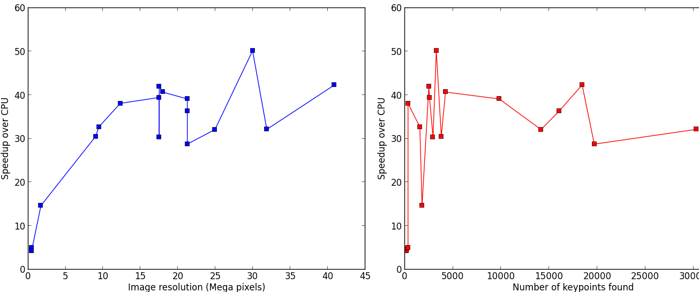
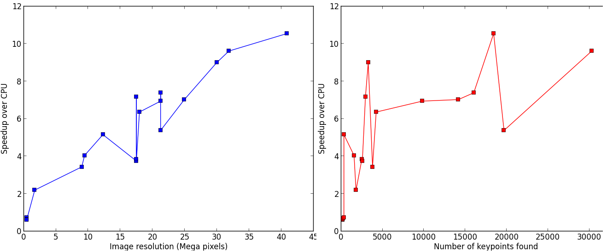
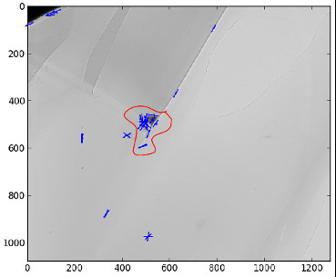

General introduction to sift.
=============================

silx.opencl.sift, a parallel version of SIFT algorithm
------------------------------------------------------

SIFT (Scale-Invariant Feature Transform) is an algorithm developed by David Lowe in 1999.
It is a worldwide reference for image alignment and object recognition.
The robustness of this method enables to detect features at different scales,
angles and illumination of a scene.
The implementation available in silx uses OpenCL, meaning that it can run on
Graphics Processing Units (GPU) as well as on Central Processing Units (CPU).
Interesting points (keypoints) are detected in the image, then data structures called
*descriptors*, characteristic of the scene, are extracted so that two different
images of the same scene exhibit similar descriptors.
The descriptors are insensitive to transformations like translation, rotation,
rescaling and illumination changes, making SIFT interesting for image stitching.

In the fist stage, descriptors are computed from the input images.
Then, they are compared against each other to determine the geometric transformation
to apply in order to align the images.
*silx.opencl.sift* can run on most GPU and CPU, offerng a large flexibility.
OpenCL processes are driven from Python via PyOpenCL, a module to access OpenCL
the parallel computation API.

Introduction
------------

The European Synchrotron Radiation Facility (ESRF) beamline ID21 developed a
full-field method for X-ray absorption near-edge spectroscopy (XANES).
Since the flat field images and the sample transmission images are not acquired
simultaneously, an image realignment procedure has to be performed.
The sequential SIFT implementation used to take about 8 seconds per frame, and
one typical stack can have up to 500 frames.
This is a bottleneck in the global process, hence a parallel version had to be
implemented.
*silx.opencl.sift* differs from existing parallel implementations of SIFT in the way
that the whole process is executed on the device, enabling crucial speed-ups.

Launching silx.opencl.sift
--------------------------

silx.opencl.sift is written in Python, and handles the OpenCL kernels through PyOpenCL.
This enables a simple and efficient access to GPU resources.
The package is installed as a Python library and can be imported in a script.

Prior to image alignment, keypoints have to be detected in each image and their
descriptors calculated.
The whole process can be launched by several lines of code.

How to use it
.............

*silx.opencl.sift* is installed as a part of *silx* and requires PyOpenCL.
One can also launch silx.opencl.sift interactively with IPython:
This computes and shows the last keypoint of the input image.
Color input images are converted to grayscale automatically during the processing.
One can specify the devicetype, either "CPU" or "GPU".

.. code-block:: python

   from silx.opencl import sift
   import numpy
   import scipy.misc
   image_rgb = scipy.misc.imread("my_image.jpg")
   sift_ocl = sift.SiftPlan(template=image_rgb, devicetype="GPU")
   kp = sift_ocl.keypoints(image_rgb)
   print(kp[-1])

silx.opencl.sift files
......................

The Python sources are in the ``silx.opencl.sift`` module:

.. code-block:: python

    from silx.image import sift
    print(sift.__file__)

The file ``plan.py`` contains the keypoint extraction code and drives the whole
process: from kernel compilation to descriptors generation as numpy array.
The OpenCL kernels are distributed as *resources* in the "openCL" folder; they
are compiled on the fly.
Several kernels have multiple implementations, depending on the computer architecture
to run on.

The file ``match.py`` carries out the matching between two lists of keypoints
returned by ``plan.py``.

The file ``alignment.py`` performes the image alignment : it computes the keypoints
from two images (``plan.py``), then uses the matching result (``match.py``)
to find out the transformation aligning the second image on the first.

Each of these modules contains a class which holds GPU contexts, memory and kernel.
They are expensive to instantiate and should be re-used as much as possible.

Overall process
***************

The different steps of SIFT are controled by ``plan.py``.
When launched, it automatically chooses the best device to run on, unless a device
is explicitly provided in the options.
All the OpenCL kernels that can be compiled are built on the fly.
Buffers are pre-allocated on the device, and all the steps are executed on the device (GPU).
At each *octave* (scale level), keypoints are returned to the CPU and the buffers are re-used.

Once computed, the keypoints of two different images can be compared.
This matching is done by ``match.py``.
It simply takes the descriptors of the two lists of keypoints, and compares them
using a L1 distance (absolute value).
It returns a vector of *matching-keypoints*, i.e couples of similar keypoints.

For image alignment, ``alignment.py`` takes the matching vector between two images
and determines the transformation to be done in order to align the second image on the first.

SIFT keypoints computation
--------------------------

The keypoints are detected in several steps according to Lowe's paper_ :

.. _paper: http://www.cs.ubc.ca/~lowe/papers/ijcv04.pdf

* Keypoints detection: local extrema are detected in the *scale-space* :math:`(x, y, s)`.
  Every pixel is compared to its neighborhood in the image itself,
  and in the previous/next scale factor images.
* Keypoints refinement: keypoints located on corners are discarded.
  Additionally, a second-order interpolation is done to improve the keypoints
  accuracy, modifying the coordinates :math:`(x, y, s)`.
* Orientation assignment: a characteristic orientation is assigned to the
  keypoints :math:`(x,y,s, \theta)`
* Descriptor computation: a histogram of orientations is built around every keypoint,
  then concatenated in a 128-values vector.
  This vector is called *SIFT descriptor*, it is insensitive to rotation, illumination, translation and scaling.

The scale variation is simulated by blurring the image.
A very blurred image represents a scene seen from a distance, in which small
details are no more visible.

Unlike existing parallel versions of SIFT, the entire process is done on the
device to avoid time-consuming transfers between CPU and GPU.
This leads to several tricky parts like the use of atomic instructions, or
using different versions of the same kernel taylored for different platforms.

Keypoints detection
...................

The image is increasingly blurred to imitate the scale variations.
This is done by convolving the image with a Gaussian kernel.
Then, consecutive blurs are subtracted to get *differences of Gaussians (DoG)*.
In these DoG, every pixel is tested. Let :math:`(x,y)` be the pixel position in
the current (blurred) image, and :math:`s` its *scale* (that is, the blur factor).
The point :math:`(x,y,s)` is a local maximum in the scale-space if

* :math:`D(x-1, y, s) < D(x,y,s)` and :math:`D(x,y,s) > D(x+1, y, s)` (local maximum in :math:`x`)
* :math:`D(x, y-1, s) < D(x,y,s)` and :math:`D(x,y,s) > D(x, y+1, s)` (local maximum in :math:`y`)
* :math:`D(x, y, s -1) < D(x,y,s)` and :math:`D(x,y,s) > D(x, y, s+1)` (local maximum in :math:`s`)

Those steps highly benefit from the parallelism of the OpenCL: every pixel is processed
by a different thread.
Besides, the convolution is implemented in the direct space (without Fourier Transform)
and is quite fast (50 times faster than the convolutions in the C++ reference
implementation).

Keypoints refinement
....................

At this stage, many keypoints are not reliable. Low-contrast keypoints are discarded,
and keypoints located on an edge are rejected as well.
For keypoints located on an edge, the principal curvature across the edge is much larger
than the principal curvature along it.
Finding these principal curvatures amounts
to solving for the eigenvalues of the second-order Hessian matrix of the current DoG.

To improve keypoints accuracy, the coordinates are interpolated with a second-order
Taylor series.

   .. math::

      D \left( \vec{x} + \vec{\delta_x} \right) \simeq D + \dfrac{\partial D}{\partial \vec{x}} \cdot \vec{\delta_x} + \dfrac{1}{2} \left( \vec{\delta_x} \right)^T \cdot \left( H \right) \cdot \vec{\delta_x} \qquad \text{with } H = \dfrac{\partial^2 D}{\partial \vec{x}^2}

Keypoints too far from a *true* (interpolated) extremum are also rejected.

Orientation assignment
......................

An orientation has to be assigned to each keypoint, so that SIFT descriptors will
be invariant to rotation.
For each blurred version of the image, the gradient
magnitude and orientation are computed.
From the neighborhood of a keypoint, a histogram of orientations is built
(36 bins, 1 bin per 10 degrees).

The maximum value of this histogram is the dominant orientation ; it is defined
as the characteristic orientation of the keypoint.
Additionally, every peak greater than 80% of the maximum generates a new
keypoint with a different orientation.

The parallel implementation of this step is complex, and the performances strongly
depend on the graphic card the program is running on.
That is why different opencl kernels have been written with the same signature,
but adapted to different platforms.
The kernel to be used are automatically determined in ``plan.py``.

Descriptor computation
......................

A histogram of orientations is built around every keypoint.
The neighborhood is divided into 4 regions, each of  4 sub-regions of 4x4 pixels.
In every sub-region, a 8-bin histogram is computed; then, all the histograms are
concatenated in a 128-value descriptor (4x4x8 = 128).
The concatenated histogram is weighted by the gradient magnitudes and the current
scale factor, so that the descriptor is invariant to rotation, illumination,
translation and scaling.
Here again, there are several kernels adapted to different platforms.

Image matching and alignment
----------------------------

Matching is also explained in this tutorial:  once the keypoints are extracted
from two images, their descriptors (128-value vector) are compared two by two,
using the L1-norm (sum of absolute value difference).

For a given keypoint K1 from the image 1, a keypoint K2 from image 2 matches K1
if the L1-distance between K1-K2 is much shorter than any other pair K1-Kn for
any other keypoint of image 2.

Once keypoints are matched, building the afine transformation with the
least-squares displacement is done using a singular value decomposition of the
over-complete system of equation.

Performances
------------

The aim of silx.opencl.sift is to speed-up the SIFT keypoint extraction by
running it on GPU.
On big images with many keypoints, this module enables a speed-up between 30 and
50 times.
The following benchmark has been carried out on an Intel Xeon E5-2667 (2.90GHz, 2x6 cores)
CPU, and a NVidia Tesla K20m GPU.

*silx.opencl.sift* can also be run on CPU, even running up to 10 times faster
than the reference C++ implementation.

SIFT parameters
---------------

SiftPlan constructor parameters
...............................

When instanciated, silx.opencl.sift.SiftPlan can take several optionnal parameters
like the device to run on and the *number of pixels per keypoint*.
By default ``PIX_PER_KP`` is 10, meaning that on guesses one keypoint will be found
every 10 pixels.
This initial step is setout for buffer allocation on the device, as the number
of keypoints that
will be found is unknown, and strongly depends of the type of image.
10 pixels per keypoint is a conservative estimation, even for images with many
features like landscapes.
For example, a 5.8 MPixels image (of ESRF) yields about 2500 keypoints, hence
2270 pixels per keypoint.

If one has large images with few features and the image does not fit on the GPU,
you can increase ``PIX_PER_KP`` in the constructor options in order to
decrease the amount of memory required.

Advanced SIFT parameters
........................

The file ``param.py`` in the source folder contains SIFT default parameters,
recommended by David Lowe in his paper_ or by the authors of the C++ version in ASIFT_.
The user should not modify these values unless one is an advanced SIFT-user.
Some parameters require the understanding of several aspects of the algorithm,
explained in Lowe's original paper.

.. _ASIFT: http://www.ipol.im/pub/art/2011/my-asift

``DoubleImSize`` (0 by default) stands for the pre-blur factor of the image.
At the beginning, the original image is blurred (*prior-smoothing*) to eliminate noise.
The standard deviation of the Gaussian filter is either ``1.52`` (if DoubleImSize is 0),
or ``1.25`` (if DoubleImSize is 1).
Setting this parameter to 1 decreases the prior-smoothing factor, hence the algorithm
will certainly find more keypoints but less accurate, as they result from the noise of
the first octave.

``InitSigma`` (1.6 by default) is the prior-smoothing factor.
The original image is blurred by a Gaussian filter which standard deviation is
:math:`\sqrt{\text{InitSigma}^2 - c^2}`.
with ``c = 0.5`` if ``DoubleImSize == 0`` or ``c = 1`` otherwise.
Once again, if the prior-smoothing factor is decreased, the algorithm will find
more keypoint in the first octave, located in the noise of the image.

``BorderDist`` (5 by default) is the minimum distance from a keypoint to the image
borders:
Border to create artefacts in the bluring procedure and in the gradiant.
pixels that are less than ``BorderDist`` pixels from the border will be ignored
for the processing.
If the featuring keypoints are near the borders, decreasing this parameter will
enable onr to detect them but their descriptor are probably less reliable.

``Scales`` (3 by default) is the number of Difference of Gaussians (DoG) that will
actually be used for keypoints detection within an octave.
In the Gaussian hierarchical pyramid, Scales+3 subsequently blured images are
used to compute Scales+2 DoGs.
The DoGs in the middle are used to detect keypoints in the scale-space.
If ``Scales`` is 3, there will be 6 blurs and 5 DoGs in an octave, and 3 DoGs
will be used for local extrema detection.
Increasing Scales will produce more blurred images in an octave, thus SIFT can detect
a few more reliable keypoints,
however, it will slow down the execution for a few additional keypoints.

``PeakThresh`` (255 * 0.04/3.0 by default) is the grayscale threshold for keypoints
refinement.
To discard low-contrast keypoints, every pixel whose grayscale value is below
this threshold cannot become a keypoint.
Decreasing this threshold will lead to a larger number of keypoints, which can
be useful for detecting features in low-contrast areas.

``EdgeThresh`` (0.06 by default) and ``EdgeThresh1`` (0.08 by default) are the
limit ratios of principal curvatures while testing if keypoints are located on an edge.
Those points are not reliable for they are sensivite to noise.
For such points, the principal curvature across the edge is much larger than the
principal curvature along it.
Finding these principal curvatures amounts to solving for the eigenvalues of the
second-order Hessian matrix of the current DoG.
The ratio of the curvatures is compared to a threshold.
In the first octave, the value 0.06 is taken instead of 0.08.
Decreasing these values leads to a larger number of keypoints, but more sensivite to
noise because they are located on edges, hence sliding.

``OriSigma`` (1.5 by default) is related to the radius of Gaussian weighting while
assessing the orientation for a keypoint.
At this stage, for a given keypoint, we look into a region of radius
:math:`3 \times s \times \text{OriSigma}`, :math:`s` being the scale of the
current keypoint.
Increasing ``OriSigma`` will not lead to increasing the number of keypoints found;
it will instead take a larger area into account while determining the orientation
assignment.
The descriptor will therefore be characteristic of a larger neighbourhood.

``MatchRatio`` (0.73 by default) is the threshold used for image alignment.
Descriptors are compared with a :math:`L^1`-distance.
For a given descriptor, if the ratio of distances between the closest-neighbour and the
second-closest-neighbour is below this threshold, then the closest-neighbour
matches the descriptor and the matching pair is added to the list.
Increasing this value leads to a larger number of matching occurences, certainly
less accurate.

Region of Interest for image alignment
......................................

When performing the image matching, a region of interest (ROI) can be specified
in the image.
The ROI is a binary image which can have any shape.
For instance, if a sample is centred on the image, the user can select the
centre of the image before processing it.

This both accelerates the processing and avoids trying to match keypoints that
are not on the sample.

References
..........

- David G. Lowe, Distinctive image features from scale-invariant keypoints,
  International Journal of Computer Vision, vol. 60, no 2, 2004, p. 91–110 -
  "http://www.cs.ubc.ca/~lowe/papers/ijcv04.pdf"

