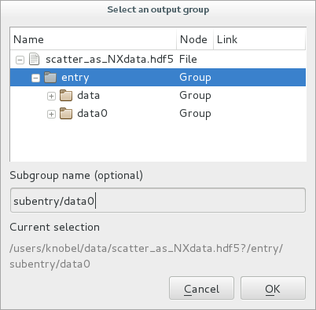

.. currentmodule:: silx.gui

:mod:`dialog`: Dialog widgets
-----------------------------

.. automodule:: silx.gui.dialog

Snapshot of the widgets:

.. |imgImageFileDialog| image:: ./img/imagefiledialog_h5.png
   :height: 150px
   :align: middle

.. |imgDataFileDialog| image:: ./img/datafiledialog.png
   :height: 150px
   :align: middle

.. |imgColormapDialog| image:: ./img/colormapdialog.png
   :height: 150px
   :align: middle

======================== ========================= ========================
|imgImageFileDialog|      |imgDataFileDialog|      |imgColormapDialog|
:class:`ImageFileDialog`  :class:`DataFileDialog`  :class:`ColormapDialog`
======================== ========================= ========================

.. |imgDatasetDialog| image:: ./img/datasetdialog.png
   :height: 150px
   :align: middle

========================== ==========================
|imgGroupDialog|           |imgDatasetDialog|
:class:`GroupDialog`       :class:`DatasetDialog`
========================== ==========================

Public modules:

.. toctree::
   :maxdepth: 2

   imagefiledialog.rst
   datafiledialog.rst
   abstractdatafiledialog.rst
   groupdialog.rst
   datasetdialog.rst
   colormapdialog.rst

