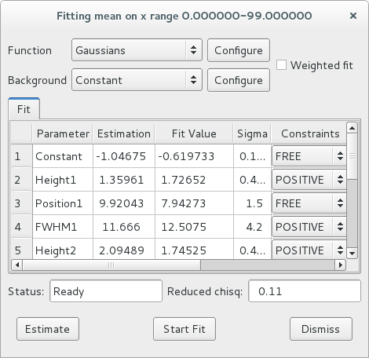
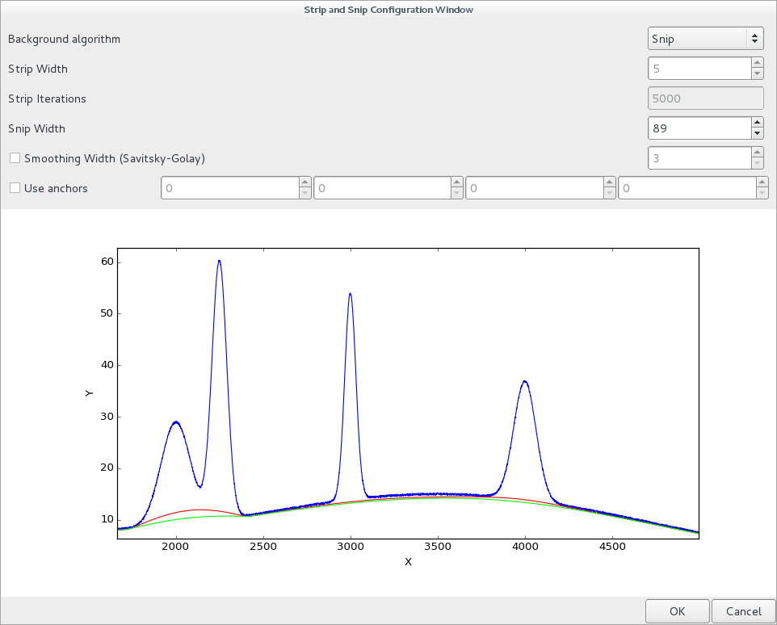

.. currentmodule:: silx.gui

:mod:`fit`: Fit widgets
------------------------

.. automodule:: silx.gui.fit

Snapshot of the widgets:

=================== ==========================
|imgFitWidget|      |imgBGWidget|
:class:`FitWidget`  :class:`BackgroundWidget`
=================== ==========================

Public modules:

.. toctree::
   :maxdepth: 2

   fitwidget.rst
   backgroundwidget.rst

