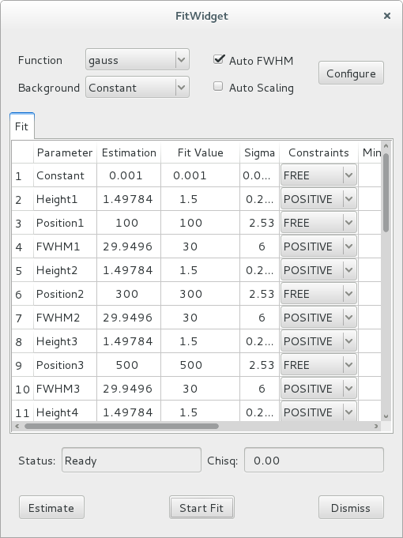

.. currentmodule:: silx.gui

:mod:`fit`: Fit widgets
------------------------

.. automodule:: silx.gui.fit

Snapshot of the widgets:

.. |imgFitWidget2| image:: img/fitwidget2.png
   :height: 150px
   :align: middle

=================== ===================
|imgFitWidget1|     |imgFitWidget2|
:class:`FitWidget`  Fit configuration
=================== ===================

Public modules:

.. toctree::
   :maxdepth: 2

   fitwidget.rst

