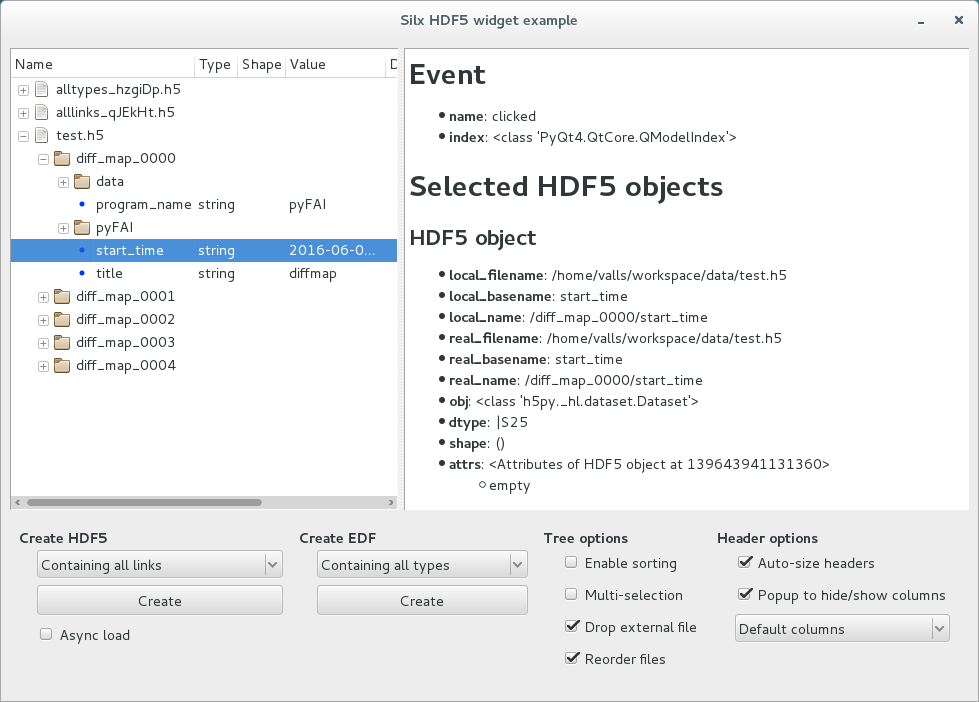

.. currentmodule:: silx.gui.hdf5

Getting started with HDF5 widgets
=================================

Silx provides an implementation of a tree model and a tree view for HDF5 files.
The aim of this tree is to provide a convenient read-only widget supporting file formats often used in synchrotrons for big amounts of data.

This page displays some source code to explain how to use this widget.

Commented source code
---------------------

Import and create your tree view
++++++++++++++++++++++++++++++++

HDF5 widgets are all exposed by the package `silx.gui.hdf5`.

.. testsetup:: *

   from silx.gui import qt
   app = qt.QApplication([])
   import silx.gui.hdf5
   treeview = silx.gui.hdf5.Hdf5TreeView()
   header = treeview.header()
   model = treeview.findHdf5TreeModel()

.. testcode::

   import silx.gui.hdf5
   treeview = silx.gui.hdf5.Hdf5TreeView()

Custom your tree view
+++++++++++++++++++++

The tree view can be customised to be sorted by default.

.. testcode::

   # Sort content of files by time or name
   treeview.setSortingEnabled(True)

The model can be customised to support mouse interaction.
A convenient method, i.e., :meth:`Hdf5TreeView.findHdf5TreeModel`, returns the main
HDF5 model used through proxy models.

.. testcode::

   model = treeview.findHdf5TreeModel()

   # Avoid the user to drop file in the widget
   model.setFileDropEnabled(False)

   # Allow the user to reorder files with drag-and-drop
   model.setFileMoveEnabled(True)

The tree view is also provided with a custom header that helps to choose visible columns.

.. testcode::

   header = treeview.header()

   # Select displayed columns
   column_ids = [treeview.findHdf5TreeModel().NAME_COLUMN]
   header.setSections(column_ids)

   # Do not allow the user to custom visible columns
   header.setEnableHideColumnsPopup(False)

Add a file by name
++++++++++++++++++

The model can be used to add an HDF5 file. It is internally using
:func:`silx.io.open`.

.. code-block:: python

   model.insertFile("test.h5")

Add a file using h5py
+++++++++++++++++++++

The model internally uses the :mod:`h5py` object API.
We can use directly h5py Files, Groups and Datasets.

.. code-block:: python

   import h5py
   h5 = h5py.File("test.h5")

   # We can use file
   model.insertH5pyObject(h5)

   # or group or dataset
   model.insertH5pyObject(h5["group1"])
   model.insertH5pyObject(h5["group1/dataset50"])

Add a file using silx
+++++++++++++++++++++

Silx also provides an input API and supports HDF5 files through :mod:`h5py`.

.. code-block:: python

   import silx.io

   # We can load HDF5 files
   model.insertH5pyObject(silx.io.open("test.h5"))

   # or Spec files
   model.insertH5pyObject(silx.io.open("test.dat"))

Custom context menu
+++++++++++++++++++

The :class:`Hdf5TreeView` provides a callback API to populate the context menu.
The callback receives a :class:`Hdf5ContextMenuEvent` every time the user
requests the context menu. The event contains :class:`H5Node` objects which wrap
h5py objects adding extra information.

.. testcode::

   def my_action_callback(obj):
      # do what you want
      pass

   def my_callback(event):
      objects = list(event.source().selectedH5Nodes())
      obj = objects[0]  # for single selection

      menu = event.menu()
      if obj.ntype is h5py.Dataset:
         action = qt.QAction("My funky action on datasets only", menu)
         action.triggered.connect(lambda: my_action_callback(obj))
         menu.addAction(action)

   treeview.addContextMenuCallback(my_callback)

Capture selection
+++++++++++++++++

The :class:`Hdf5TreeView` widget provides default Qt signals inherited from
`QAbstractItemView`.

- `activated`:
      This signal is emitted when the item specified by index is
      activated by the user. How to activate items depends on the platform,
      e.g., by single- or double-clicking the item, or by pressing the
      Return or Enter key when the item is the current one.
- `clicked`:
      This signal is emitted when a mouse button is clicked. The item selected by
      mouse click is specified by index. The signal is only emitted when the
      index is a valid one.
- `doubleClicked`:
      This signal is emitted when a mouse button is double-clicked.
      The selected item is specified by index.
      The signal is only emitted when the index is a valid one.
- `entered`:
      This signal is emitted when the mouse cursor enters the item specified by
      index. Mouse tracking needs to be enabled for this feature to work.
- `pressed`:
      This signal is emitted when a mouse button is pressed.
      The selected item is specified by index.
      The signal is only emitted when the index is a valid one.

The method :meth:`Hdf5TreeView.selectedH5Nodes` returns an iterator of :class:`H5Node`
objects which wrap h5py objects adding extra information.

.. testcode::

   def my_callback(index):
       objects = list(treeview.selectedH5Nodes())
       obj = objects[0]  # for single selection

       print(obj)

       print(obj.basename)             # not provided by h5py
       print(obj.name)
       print(obj.file.filename)

       print(obj.local_basename)       # not provided by h5py
       print(obj.local_name)           # not provided by h5py
       print(obj.local_file.filename)  # not provided by h5py

       print(obj.attrs)

       if obj.ntype is h5py.Dataset:
           print(obj.dtype)
           print(obj.shape)
           print(obj.value)        # create a copy of data of the dataset
           print(obj.h5py_object)  # reference to the Hdf5 dataset (or group)

   treeview.clicked.connect(my_callback)

Example
-------

.. toctree::
   :hidden:

   examples_hdf5widget.rst

The :doc:`examples_hdf5widget` sample code provides an example of properties of
the view, model and header.

Source code: :doc:`examples_hdf5widget`.

After installing `silx` and downloading the script, you can run it from the
command line prompt:

.. code-block:: bash

   python hdf5widget.py <files>

This example loads files added to the command line, or files dropped from the
file system. It also provides a GUI to display dummy test files.
