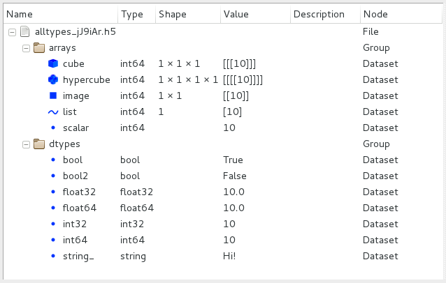

.. currentmodule:: silx.gui

:mod:`hdf5`: HDF5 widgets
=========================

.. toctree::
   :hidden:

   getting_started.rst

.. currentmodule:: silx.gui.hdf5

.. automodule:: silx.gui.hdf5

For an introduction to the widgets of this package, see :doc:`getting_started`.

Widgets gallery
---------------

.. list-table::
   :widths: 1 4
   :header-rows: 1

   * - Widget
     - Description
   * - |imgHdf5TreeView|
     - :class:`Hdf5TreeView` is the base Qt widget providing a tree view of
       multiple HDF5 files, or assimilated file with an adapter.

Public modules
--------------

.. toctree::
   :maxdepth: 2

   hdf5treeview.rst
   hdf5treemodel.rst
   hdf5contextmenuevent.rst
   h5node.rst
   hdf5headerview.rst
   nexussortfilterproxymodel.rst
