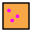
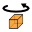
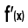
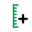
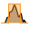
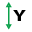
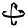

.. AUTOMATICALLY GENERATED FILE DO NOT EDIT
   Use update_icons_rst.py script instead

.. currentmodule:: silx.gui

:mod:`icons`: Set of icons
--------------------------

.. automodule:: silx.gui.icons
   :members:

Available icons
+++++++++++++++

.. list-table::
   :widths: 1 4
   :header-rows: 1

   * - Icon
     - Name
   * - |3d-plane-normal-x|
     - 3d-plane-normal-x
   * - |3d-plane-normal-y|
     - 3d-plane-normal-y
   * - |3d-plane-normal-z|
     - 3d-plane-normal-z
   * - |3d-plane-pan|
     - 3d-plane-pan
   * - |3d-plane|
     - 3d-plane
   * - |add-range-horizontal|
     - add-range-horizontal
   * - |add-shape-arc|
     - add-shape-arc
   * - |add-shape-circle|
     - add-shape-circle
   * - |add-shape-cross|
     - add-shape-cross
   * - |add-shape-diagonal|
     - add-shape-diagonal
   * - |add-shape-ellipse|
     - add-shape-ellipse
   * - |add-shape-horizontal|
     - add-shape-horizontal
   * - |add-shape-point|
     - add-shape-point
   * - |add-shape-polygon|
     - add-shape-polygon
   * - |add-shape-rectangle|
     - add-shape-rectangle
   * - |add-shape-rotated-rectangle|
     - add-shape-rotated-rectangle
   * - |add-shape-unknown|
     - add-shape-unknown
   * - |add-shape-vertical|
     - add-shape-vertical
   * - |add|
     - add
   * - |aggregation-mode|
     - aggregation-mode
   * - |arrow-keys|
     - arrow-keys
   * - |axis|
     - axis
   * - |backend-opengl|
     - backend-opengl
   * - |camera|
     - camera
   * - |clipboard|
     - clipboard
   * - |close|
     - close
   * - |colorbar|
     - colorbar
   * - |colormap-histogram|
     - colormap-histogram
   * - |colormap-none|
     - colormap-none
   * - |colormap-norm-arcsinh|
     - colormap-norm-arcsinh
   * - |colormap-norm-gamma|
     - colormap-norm-gamma
   * - |colormap-norm-linear|
     - colormap-norm-linear
   * - |colormap-norm-log|
     - colormap-norm-log
   * - |colormap-norm-sqrt|
     - colormap-norm-sqrt
   * - |colormap-range|
     - colormap-range
   * - |colormap|
     - colormap
   * - |compare-align-auto|
     - compare-align-auto
   * - |compare-align-center|
     - compare-align-center
   * - |compare-align-origin|
     - compare-align-origin
   * - |compare-align-stretch|
     - compare-align-stretch
   * - |compare-keypoints|
     - compare-keypoints
   * - |compare-mode-a-minus-b|
     - compare-mode-a-minus-b
   * - |compare-mode-a|
     - compare-mode-a
   * - |compare-mode-b|
     - compare-mode-b
   * - |compare-mode-hline|
     - compare-mode-hline
   * - |compare-mode-rb-channel|
     - compare-mode-rb-channel
   * - |compare-mode-rbneg-channel|
     - compare-mode-rbneg-channel
   * - |compare-mode-vline|
     - compare-mode-vline
   * - |crop|
     - crop
   * - |crosshair|
     - crosshair
   * - |cube-back|
     - cube-back
   * - |cube-bottom|
     - cube-bottom
   * - |cube-front|
     - cube-front
   * - |cube-left|
     - cube-left
   * - |cube-right|
     - cube-right
   * - |cube-rotate|
     - cube-rotate
   * - |cube-top|
     - cube-top
   * - |cube|
     - cube
   * - |description-description|
     - description-description
   * - |description-error|
     - description-error
   * - |description-name|
     - description-name
   * - |description-program|
     - description-program
   * - |description-title|
     - description-title
   * - |description-value|
     - description-value
   * - |document-open|
     - document-open
   * - |document-print|
     - document-print
   * - |document-save|
     - document-save
   * - |draw-brush|
     - draw-brush
   * - |draw-pencil|
     - draw-pencil
   * - |draw-rubber|
     - draw-rubber
   * - |edit-copy|
     - edit-copy
   * - |eye|
     - eye
   * - |first|
     - first
   * - |folder|
     - folder
   * - |image-mask|
     - image-mask
   * - |image-select-add|
     - image-select-add
   * - |image-select-box|
     - image-select-box
   * - |image-select-brush|
     - image-select-brush
   * - |image-select-erase-rubber|
     - image-select-erase-rubber
   * - |image-select-erase|
     - image-select-erase
   * - |image|
     - image
   * - |item-0dim|
     - item-0dim
   * - |item-1dim|
     - item-1dim
   * - |item-2dim|
     - item-2dim
   * - |item-3dim|
     - item-3dim
   * - |item-ndim|
     - item-ndim
   * - |item-none|
     - item-none
   * - |item-object|
     - item-object
   * - |last|
     - last
   * - |layer-nx|
     - layer-nx
   * - |mask-clear-all|
     - mask-clear-all
   * - |mask-clear|
     - mask-clear
   * - |mask-invert|
     - mask-invert
   * - |math-amplitude|
     - math-amplitude
   * - |math-average|
     - math-average
   * - |math-derive|
     - math-derive
   * - |math-energy|
     - math-energy
   * - |math-fit|
     - math-fit
   * - |math-imaginary|
     - math-imaginary
   * - |math-mean|
     - math-mean
   * - |math-normalize|
     - math-normalize
   * - |math-peak-reset|
     - math-peak-reset
   * - |math-peak-search|
     - math-peak-search
   * - |math-peak|
     - math-peak
   * - |math-phase-color-log|
     - math-phase-color-log
   * - |math-phase-color|
     - math-phase-color
   * - |math-phase|
     - math-phase
   * - |math-real|
     - math-real
   * - |math-sigma|
     - math-sigma
   * - |math-smooth|
     - math-smooth
   * - |math-square-amplitude|
     - math-square-amplitude
   * - |math-substract|
     - math-substract
   * - |math-swap-sign|
     - math-swap-sign
   * - |math-ymin-to-zero|
     - math-ymin-to-zero
   * - |median-filter|
     - median-filter
   * - |next|
     - next
   * - |normal|
     - normal
   * - |nxdata-axis-add|
     - nxdata-axis-add
   * - |nxdata-axis-remove|
     - nxdata-axis-remove
   * - |nxdata-create|
     - nxdata-create
   * - |nxdata-remove|
     - nxdata-remove
   * - |pan|
     - pan
   * - |pixel-intensities|
     - pixel-intensities
   * - |plot-grid|
     - plot-grid
   * - |plot-roi-above|
     - plot-roi-above
   * - |plot-roi-below|
     - plot-roi-below
   * - |plot-roi-between|
     - plot-roi-between
   * - |plot-roi-reset|
     - plot-roi-reset
   * - |plot-roi|
     - plot-roi
   * - |plot-symbols|
     - plot-symbols
   * - |plot-toggle-points|
     - plot-toggle-points
   * - |plot-widget|
     - plot-widget
   * - |plot-window-image|
     - plot-window-image
   * - |plot-window|
     - plot-window
   * - |plot-xauto|
     - plot-xauto
   * - |plot-xlog|
     - plot-xlog
   * - |plot-yauto|
     - plot-yauto
   * - |plot-ydown|
     - plot-ydown
   * - |plot-ylog|
     - plot-ylog
   * - |plot-yup|
     - plot-yup
   * - |pointing-hand|
     - pointing-hand
   * - |previous|
     - previous
   * - |profile-clear|
     - profile-clear
   * - |profile1D|
     - profile1D
   * - |profile2D|
     - profile2D
   * - |remove|
     - remove
   * - |rm|
     - rm
   * - |rotate-3d|
     - rotate-3d
   * - |rudder|
     - rudder
   * - |ruler|
     - ruler
   * - |scale-auto|
     - scale-auto
   * - |scale-fixed|
     - scale-fixed
   * - |selected|
     - selected
   * - |shape-circle-solid|
     - shape-circle-solid
   * - |shape-circle|
     - shape-circle
   * - |shape-cross|
     - shape-cross
   * - |shape-diagonal-directed|
     - shape-diagonal-directed
   * - |shape-diagonal|
     - shape-diagonal
   * - |shape-ellipse-solid|
     - shape-ellipse-solid
   * - |shape-ellipse|
     - shape-ellipse
   * - |shape-horizontal|
     - shape-horizontal
   * - |shape-polygon|
     - shape-polygon
   * - |shape-rectangle|
     - shape-rectangle
   * - |shape-square|
     - shape-square
   * - |shape-vertical|
     - shape-vertical
   * - |side-histograms|
     - side-histograms
   * - |silx|
     - silx
   * - |slice-cross|
     - slice-cross
   * - |slice-horizontal|
     - slice-horizontal
   * - |slice-vertical|
     - slice-vertical
   * - |sliders-off|
     - sliders-off
   * - |sliders-on|
     - sliders-on
   * - |spec|
     - spec
   * - |stats-active-items|
     - stats-active-items
   * - |stats-visible-data|
     - stats-visible-data
   * - |stats-whole-data|
     - stats-whole-data
   * - |stats-whole-items|
     - stats-whole-items
   * - |tree-collapse-all|
     - tree-collapse-all
   * - |tree-expand-all|
     - tree-expand-all
   * - |tree-sort|
     - tree-sort
   * - |view-1d|
     - view-1d
   * - |view-2d-stack|
     - view-2d-stack
   * - |view-2d|
     - view-2d
   * - |view-3d|
     - view-3d
   * - |view-fullscreen|
     - view-fullscreen
   * - |view-hdf5|
     - view-hdf5
   * - |view-nexus|
     - view-nexus
   * - |view-nofullscreen|
     - view-nofullscreen
   * - |view-raw|
     - view-raw
   * - |view-refresh|
     - view-refresh
   * - |view-text|
     - view-text
   * - |window-new|
     - window-new
   * - |zoom-back|
     - zoom-back
   * - |zoom-in|
     - zoom-in
   * - |zoom-original|
     - zoom-original
   * - |zoom-out|
     - zoom-out
   * - |zoom|
     - zoom

.. |3d-plane-normal-x| image:: ../../../../src/silx/resources/gui/icons/3d-plane-normal-x.png
.. |3d-plane-normal-y| image:: ../../../../src/silx/resources/gui/icons/3d-plane-normal-y.png
.. |3d-plane-normal-z| image:: ../../../../src/silx/resources/gui/icons/3d-plane-normal-z.png
.. |3d-plane-pan| image:: ../../../../src/silx/resources/gui/icons/3d-plane-pan.png
.. |3d-plane| image:: ../../../../src/silx/resources/gui/icons/3d-plane.png
.. |add-range-horizontal| image:: ../../../../src/silx/resources/gui/icons/add-range-horizontal.png

.. |add-shape-circle| image:: ../../../../src/silx/resources/gui/icons/add-shape-circle.png
.. |add-shape-cross| image:: ../../../../src/silx/resources/gui/icons/add-shape-cross.png

.. |add-shape-ellipse| image:: ../../../../src/silx/resources/gui/icons/add-shape-ellipse.png
.. |add-shape-horizontal| image:: ../../../../src/silx/resources/gui/icons/add-shape-horizontal.png
.. |add-shape-point| image:: ../../../../src/silx/resources/gui/icons/add-shape-point.png
.. |add-shape-polygon| image:: ../../../../src/silx/resources/gui/icons/add-shape-polygon.png
.. |add-shape-rectangle| image:: ../../../../src/silx/resources/gui/icons/add-shape-rectangle.png

.. |add-shape-unknown| image:: ../../../../src/silx/resources/gui/icons/add-shape-unknown.png
.. |add-shape-vertical| image:: ../../../../src/silx/resources/gui/icons/add-shape-vertical.png
.. |add| image:: ../../../../src/silx/resources/gui/icons/add.png

.. |arrow-keys| image:: ../../../../src/silx/resources/gui/icons/arrow-keys.png
.. |axis| image:: ../../../../src/silx/resources/gui/icons/axis.png
.. |backend-opengl| image:: ../../../../src/silx/resources/gui/icons/backend-opengl.png
.. |camera| image:: ../../../../src/silx/resources/gui/icons/camera.png
.. |clipboard| image:: ../../../../src/silx/resources/gui/icons/clipboard.png

.. |colorbar| image:: ../../../../src/silx/resources/gui/icons/colorbar.png
.. |colormap-histogram| image:: ../../../../src/silx/resources/gui/icons/colormap-histogram.png

.. |colormap-norm-gamma| image:: ../../../../src/silx/resources/gui/icons/colormap-norm-gamma.png

.. |colormap-norm-log| image:: ../../../../src/silx/resources/gui/icons/colormap-norm-log.png
.. |colormap-norm-sqrt| image:: ../../../../src/silx/resources/gui/icons/colormap-norm-sqrt.png
.. |colormap-range| image:: ../../../../src/silx/resources/gui/icons/colormap-range.png
.. |colormap| image:: ../../../../src/silx/resources/gui/icons/colormap.png
.. |compare-align-auto| image:: ../../../../src/silx/resources/gui/icons/compare-align-auto.png
.. |compare-align-center| image:: ../../../../src/silx/resources/gui/icons/compare-align-center.png
.. |compare-align-origin| image:: ../../../../src/silx/resources/gui/icons/compare-align-origin.png

.. |compare-mode-a-minus-b| image:: ../../../../src/silx/resources/gui/icons/compare-mode-a-minus-b.png
.. |compare-mode-a| image:: ../../../../src/silx/resources/gui/icons/compare-mode-a.png
.. |compare-mode-b| image:: ../../../../src/silx/resources/gui/icons/compare-mode-b.png

.. |compare-mode-vline| image:: ../../../../src/silx/resources/gui/icons/compare-mode-vline.png

.. |cube-back| image:: ../../../../src/silx/resources/gui/icons/cube-back.png
.. |cube-bottom| image:: ../../../../src/silx/resources/gui/icons/cube-bottom.png
.. |cube-front| image:: ../../../../src/silx/resources/gui/icons/cube-front.png
.. |cube-left| image:: ../../../../src/silx/resources/gui/icons/cube-left.png
.. |cube-right| image:: ../../../../src/silx/resources/gui/icons/cube-right.png

.. |cube-top| image:: ../../../../src/silx/resources/gui/icons/cube-top.png
.. |cube| image:: ../../../../src/silx/resources/gui/icons/cube.png
.. |description-description| image:: ../../../../src/silx/resources/gui/icons/description-description.png
.. |description-error| image:: ../../../../src/silx/resources/gui/icons/description-error.png
.. |description-name| image:: ../../../../src/silx/resources/gui/icons/description-name.png
.. |description-program| image:: ../../../../src/silx/resources/gui/icons/description-program.png

.. |document-print| image:: ../../../../src/silx/resources/gui/icons/document-print.png
.. |document-save| image:: ../../../../src/silx/resources/gui/icons/document-save.png

.. |draw-pencil| image:: ../../../../src/silx/resources/gui/icons/draw-pencil.png
.. |draw-rubber| image:: ../../../../src/silx/resources/gui/icons/draw-rubber.png

.. |eye| image:: ../../../../src/silx/resources/gui/icons/eye.png
.. |first| image:: ../../../../src/silx/resources/gui/icons/first.png
.. |folder| image:: ../../../../src/silx/resources/gui/icons/folder.png

.. |image-select-add| image:: ../../../../src/silx/resources/gui/icons/image-select-add.png
.. |image-select-box| image:: ../../../../src/silx/resources/gui/icons/image-select-box.png

.. |image-select-erase-rubber| image:: ../../../../src/silx/resources/gui/icons/image-select-erase-rubber.png
.. |image-select-erase| image:: ../../../../src/silx/resources/gui/icons/image-select-erase.png
.. |image| image:: ../../../../src/silx/resources/gui/icons/image.png
.. |item-0dim| image:: ../../../../src/silx/resources/gui/icons/item-0dim.png

.. |item-ndim| image:: ../../../../src/silx/resources/gui/icons/item-ndim.png
.. |item-none| image:: ../../../../src/silx/resources/gui/icons/item-none.png

.. |last| image:: ../../../../src/silx/resources/gui/icons/last.png

.. |mask-clear-all| image:: ../../../../src/silx/resources/gui/icons/mask-clear-all.png
.. |mask-clear| image:: ../../../../src/silx/resources/gui/icons/mask-clear.png
.. |mask-invert| image:: ../../../../src/silx/resources/gui/icons/mask-invert.png
.. |math-amplitude| image:: ../../../../src/silx/resources/gui/icons/math-amplitude.png

.. |math-energy| image:: ../../../../src/silx/resources/gui/icons/math-energy.png

.. |math-mean| image:: ../../../../src/silx/resources/gui/icons/math-mean.png

.. |math-peak-reset| image:: ../../../../src/silx/resources/gui/icons/math-peak-reset.png

.. |math-peak| image:: ../../../../src/silx/resources/gui/icons/math-peak.png
.. |math-phase-color-log| image:: ../../../../src/silx/resources/gui/icons/math-phase-color-log.png
.. |math-phase-color| image:: ../../../../src/silx/resources/gui/icons/math-phase-color.png

.. |math-real| image:: ../../../../src/silx/resources/gui/icons/math-real.png
.. |math-sigma| image:: ../../../../src/silx/resources/gui/icons/math-sigma.png
.. |math-smooth| image:: ../../../../src/silx/resources/gui/icons/math-smooth.png
.. |math-square-amplitude| image:: ../../../../src/silx/resources/gui/icons/math-square-amplitude.png
.. |math-substract| image:: ../../../../src/silx/resources/gui/icons/math-substract.png
.. |math-swap-sign| image:: ../../../../src/silx/resources/gui/icons/math-swap-sign.png
.. |math-ymin-to-zero| image:: ../../../../src/silx/resources/gui/icons/math-ymin-to-zero.png
.. |median-filter| image:: ../../../../src/silx/resources/gui/icons/median-filter.png

.. |normal| image:: ../../../../src/silx/resources/gui/icons/normal.png

.. |nxdata-axis-remove| image:: ../../../../src/silx/resources/gui/icons/nxdata-axis-remove.png

.. |pan| image:: ../../../../src/silx/resources/gui/icons/pan.png
.. |pixel-intensities| image:: ../../../../src/silx/resources/gui/icons/pixel-intensities.png

.. |plot-roi-above| image:: ../../../../src/silx/resources/gui/icons/plot-roi-above.png
.. |plot-roi-below| image:: ../../../../src/silx/resources/gui/icons/plot-roi-below.png

.. |plot-roi-reset| image:: ../../../../src/silx/resources/gui/icons/plot-roi-reset.png
.. |plot-roi| image:: ../../../../src/silx/resources/gui/icons/plot-roi.png
.. |plot-symbols| image:: ../../../../src/silx/resources/gui/icons/plot-symbols.png
.. |plot-toggle-points| image:: ../../../../src/silx/resources/gui/icons/plot-toggle-points.png
.. |plot-widget| image:: ../../../../src/silx/resources/gui/icons/plot-widget.png
.. |plot-window-image| image:: ../../../../src/silx/resources/gui/icons/plot-window-image.png
.. |plot-window| image:: ../../../../src/silx/resources/gui/icons/plot-window.png

.. |plot-xlog| image:: ../../../../src/silx/resources/gui/icons/plot-xlog.png

.. |plot-ydown| image:: ../../../../src/silx/resources/gui/icons/plot-ydown.png

.. |plot-yup| image:: ../../../../src/silx/resources/gui/icons/plot-yup.png
.. |pointing-hand| image:: ../../../../src/silx/resources/gui/icons/pointing-hand.png

.. |profile1D| image:: ../../../../src/silx/resources/gui/icons/profile1D.png
.. |profile2D| image:: ../../../../src/silx/resources/gui/icons/profile2D.png

.. |ruler| image:: ../../../../src/silx/resources/gui/icons/ruler.png

.. |selected| image:: ../../../../src/silx/resources/gui/icons/selected.png
.. |shape-circle-solid| image:: ../../../../src/silx/resources/gui/icons/shape-circle-solid.png
.. |shape-circle| image:: ../../../../src/silx/resources/gui/icons/shape-circle.png
.. |shape-cross| image:: ../../../../src/silx/resources/gui/icons/shape-cross.png
.. |shape-diagonal-directed| image:: ../../../../src/silx/resources/gui/icons/shape-diagonal-directed.png
.. |shape-diagonal| image:: ../../../../src/silx/resources/gui/icons/shape-diagonal.png
.. |shape-ellipse-solid| image:: ../../../../src/silx/resources/gui/icons/shape-ellipse-solid.png

.. |shape-horizontal| image:: ../../../../src/silx/resources/gui/icons/shape-horizontal.png
.. |shape-polygon| image:: ../../../../src/silx/resources/gui/icons/shape-polygon.png
.. |shape-rectangle| image:: ../../../../src/silx/resources/gui/icons/shape-rectangle.png
.. |shape-square| image:: ../../../../src/silx/resources/gui/icons/shape-square.png
.. |shape-vertical| image:: ../../../../src/silx/resources/gui/icons/shape-vertical.png

.. |silx| image:: ../../../../src/silx/resources/gui/icons/silx.png

.. |slice-horizontal| image:: ../../../../src/silx/resources/gui/icons/slice-horizontal.png
.. |slice-vertical| image:: ../../../../src/silx/resources/gui/icons/slice-vertical.png

.. |sliders-on| image:: ../../../../src/silx/resources/gui/icons/sliders-on.png
.. |spec| image:: ../../../../src/silx/resources/gui/icons/spec.png

.. |stats-visible-data| image:: ../../../../src/silx/resources/gui/icons/stats-visible-data.png
.. |stats-whole-data| image:: ../../../../src/silx/resources/gui/icons/stats-whole-data.png
.. |stats-whole-items| image:: ../../../../src/silx/resources/gui/icons/stats-whole-items.png
.. |tree-collapse-all| image:: ../../../../src/silx/resources/gui/icons/tree-collapse-all.png
.. |tree-expand-all| image:: ../../../../src/silx/resources/gui/icons/tree-expand-all.png
.. |tree-sort| image:: ../../../../src/silx/resources/gui/icons/tree-sort.png

.. |view-2d-stack| image:: ../../../../src/silx/resources/gui/icons/view-2d-stack.png
.. |view-2d| image:: ../../../../src/silx/resources/gui/icons/view-2d.png
.. |view-3d| image:: ../../../../src/silx/resources/gui/icons/view-3d.png
.. |view-fullscreen| image:: ../../../../src/silx/resources/gui/icons/view-fullscreen.png
.. |view-hdf5| image:: ../../../../src/silx/resources/gui/icons/view-hdf5.png
.. |view-nexus| image:: ../../../../src/silx/resources/gui/icons/view-nexus.png
.. |view-nofullscreen| image:: ../../../../src/silx/resources/gui/icons/view-nofullscreen.png
.. |view-raw| image:: ../../../../src/silx/resources/gui/icons/view-raw.png

.. |view-text| image:: ../../../../src/silx/resources/gui/icons/view-text.png

.. |zoom-in| image:: ../../../../src/silx/resources/gui/icons/zoom-in.png
.. |zoom-original| image:: ../../../../src/silx/resources/gui/icons/zoom-original.png

.. |zoom| image:: ../../../../src/silx/resources/gui/icons/zoom.png
