.. AUTOMATICALLY GENERATED FILE DO NOT EDIT
   Use update_icons_rst.py script instead

.. currentmodule:: silx.gui

:mod:`icons`: Set of icons
--------------------------

.. automodule:: silx.gui.icons
   :members:

Available icons
+++++++++++++++

.. list-table::
   :widths: 1 4
   :header-rows: 1

   * - Icon
     - Name
   * - |3d-plane-normal-x|
     - 3d-plane-normal-x
   * - |3d-plane-normal-y|
     - 3d-plane-normal-y
   * - |3d-plane-normal-z|
     - 3d-plane-normal-z
   * - |3d-plane-pan|
     - 3d-plane-pan
   * - |3d-plane|
     - 3d-plane
   * - |add-shape-arc|
     - add-shape-arc
   * - |add-shape-diagonal|
     - add-shape-diagonal
   * - |add-shape-horizontal|
     - add-shape-horizontal
   * - |add-shape-point|
     - add-shape-point
   * - |add-shape-polygon|
     - add-shape-polygon
   * - |add-shape-rectangle|
     - add-shape-rectangle
   * - |add-shape-unknown|
     - add-shape-unknown
   * - |add-shape-vertical|
     - add-shape-vertical
   * - |arrow-keys|
     - arrow-keys
   * - |axis|
     - axis
   * - |camera|
     - camera
   * - |clipboard|
     - clipboard
   * - |close|
     - close
   * - |colorbar|
     - colorbar
   * - |colormap-histogram|
     - colormap-histogram
   * - |colormap-none|
     - colormap-none
   * - |colormap-range|
     - colormap-range
   * - |colormap|
     - colormap
   * - |compare-align-auto|
     - compare-align-auto
   * - |compare-align-center|
     - compare-align-center
   * - |compare-align-origin|
     - compare-align-origin
   * - |compare-align-stretch|
     - compare-align-stretch
   * - |compare-keypoints|
     - compare-keypoints
   * - |compare-mode-a|
     - compare-mode-a
   * - |compare-mode-b|
     - compare-mode-b
   * - |compare-mode-hline|
     - compare-mode-hline
   * - |compare-mode-rb-channel|
     - compare-mode-rb-channel
   * - |compare-mode-rbneg-channel|
     - compare-mode-rbneg-channel
   * - |compare-mode-vline|
     - compare-mode-vline
   * - |crop|
     - crop
   * - |crosshair|
     - crosshair
   * - |cube-back|
     - cube-back
   * - |cube-bottom|
     - cube-bottom
   * - |cube-front|
     - cube-front
   * - |cube-left|
     - cube-left
   * - |cube-right|
     - cube-right
   * - |cube-rotate|
     - cube-rotate
   * - |cube-top|
     - cube-top
   * - |cube|
     - cube
   * - |document-open|
     - document-open
   * - |document-print|
     - document-print
   * - |document-save|
     - document-save
   * - |draw-brush|
     - draw-brush
   * - |draw-pencil|
     - draw-pencil
   * - |draw-rubber|
     - draw-rubber
   * - |edit-copy|
     - edit-copy
   * - |first|
     - first
   * - |folder|
     - folder
   * - |image-mask|
     - image-mask
   * - |image-select-add|
     - image-select-add
   * - |image-select-box|
     - image-select-box
   * - |image-select-brush|
     - image-select-brush
   * - |image-select-erase-rubber|
     - image-select-erase-rubber
   * - |image-select-erase|
     - image-select-erase
   * - |image|
     - image
   * - |item-0dim|
     - item-0dim
   * - |item-1dim|
     - item-1dim
   * - |item-2dim|
     - item-2dim
   * - |item-3dim|
     - item-3dim
   * - |item-ndim|
     - item-ndim
   * - |item-none|
     - item-none
   * - |item-object|
     - item-object
   * - |last|
     - last
   * - |layer-nx|
     - layer-nx
   * - |math-amplitude|
     - math-amplitude
   * - |math-average|
     - math-average
   * - |math-derive|
     - math-derive
   * - |math-energy|
     - math-energy
   * - |math-fit|
     - math-fit
   * - |math-imaginary|
     - math-imaginary
   * - |math-mean|
     - math-mean
   * - |math-normalize|
     - math-normalize
   * - |math-peak-reset|
     - math-peak-reset
   * - |math-peak-search|
     - math-peak-search
   * - |math-peak|
     - math-peak
   * - |math-phase-color-log|
     - math-phase-color-log
   * - |math-phase-color|
     - math-phase-color
   * - |math-phase|
     - math-phase
   * - |math-real|
     - math-real
   * - |math-sigma|
     - math-sigma
   * - |math-smooth|
     - math-smooth
   * - |math-square-amplitude|
     - math-square-amplitude
   * - |math-substract|
     - math-substract
   * - |math-swap-sign|
     - math-swap-sign
   * - |math-ymin-to-zero|
     - math-ymin-to-zero
   * - |median-filter|
     - median-filter
   * - |next|
     - next
   * - |normal|
     - normal
   * - |nxdata-axis-add|
     - nxdata-axis-add
   * - |nxdata-axis-remove|
     - nxdata-axis-remove
   * - |nxdata-create|
     - nxdata-create
   * - |nxdata-remove|
     - nxdata-remove
   * - |pan|
     - pan
   * - |pixel-intensities|
     - pixel-intensities
   * - |plot-grid|
     - plot-grid
   * - |plot-roi-above|
     - plot-roi-above
   * - |plot-roi-below|
     - plot-roi-below
   * - |plot-roi-between|
     - plot-roi-between
   * - |plot-roi-reset|
     - plot-roi-reset
   * - |plot-roi|
     - plot-roi
   * - |plot-symbols|
     - plot-symbols
   * - |plot-toggle-points|
     - plot-toggle-points
   * - |plot-widget|
     - plot-widget
   * - |plot-window-image|
     - plot-window-image
   * - |plot-window|
     - plot-window
   * - |plot-xauto|
     - plot-xauto
   * - |plot-xlog|
     - plot-xlog
   * - |plot-yauto|
     - plot-yauto
   * - |plot-ydown|
     - plot-ydown
   * - |plot-ylog|
     - plot-ylog
   * - |plot-yup|
     - plot-yup
   * - |previous|
     - previous
   * - |profile-clear|
     - profile-clear
   * - |profile1D|
     - profile1D
   * - |profile2D|
     - profile2D
   * - |remove|
     - remove
   * - |rotate-3d|
     - rotate-3d
   * - |rudder|
     - rudder
   * - |selected|
     - selected
   * - |shape-circle-solid|
     - shape-circle-solid
   * - |shape-circle|
     - shape-circle
   * - |shape-diagonal|
     - shape-diagonal
   * - |shape-ellipse-solid|
     - shape-ellipse-solid
   * - |shape-ellipse|
     - shape-ellipse
   * - |shape-horizontal|
     - shape-horizontal
   * - |shape-polygon|
     - shape-polygon
   * - |shape-rectangle|
     - shape-rectangle
   * - |shape-square|
     - shape-square
   * - |shape-vertical|
     - shape-vertical
   * - |silx|
     - silx
   * - |sliders-off|
     - sliders-off
   * - |sliders-on|
     - sliders-on
   * - |spec|
     - spec
   * - |stats-active-items|
     - stats-active-items
   * - |stats-visible-data|
     - stats-visible-data
   * - |stats-whole-data|
     - stats-whole-data
   * - |stats-whole-items|
     - stats-whole-items
   * - |tree-collapse-all|
     - tree-collapse-all
   * - |tree-expand-all|
     - tree-expand-all
   * - |view-1d|
     - view-1d
   * - |view-2d-stack|
     - view-2d-stack
   * - |view-2d|
     - view-2d
   * - |view-3d|
     - view-3d
   * - |view-fullscreen|
     - view-fullscreen
   * - |view-hdf5|
     - view-hdf5
   * - |view-nexus|
     - view-nexus
   * - |view-nofullscreen|
     - view-nofullscreen
   * - |view-raw|
     - view-raw
   * - |view-refresh|
     - view-refresh
   * - |view-text|
     - view-text
   * - |window-new|
     - window-new
   * - |zoom-back|
     - zoom-back
   * - |zoom-in|
     - zoom-in
   * - |zoom-original|
     - zoom-original
   * - |zoom-out|
     - zoom-out
   * - |zoom|
     - zoom

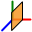
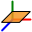
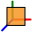

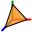

.. |add-shape-point| image:: ../../../../silx/resources/gui/icons/add-shape-point.png

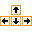

.. |close| image:: ../../../../silx/resources/gui/icons/close.png

.. |colormap-none| image:: ../../../../silx/resources/gui/icons/colormap-none.png

.. |colormap| image:: ../../../../silx/resources/gui/icons/colormap.png

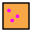

.. |crop| image:: ../../../../silx/resources/gui/icons/crop.png

.. |cube-rotate| image:: ../../../../silx/resources/gui/icons/cube-rotate.png

.. |document-open| image:: ../../../../silx/resources/gui/icons/document-open.png

.. |draw-brush| image:: ../../../../silx/resources/gui/icons/draw-brush.png

.. |edit-copy| image:: ../../../../silx/resources/gui/icons/edit-copy.png

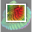
.. |image-select-brush| image:: ../../../../silx/resources/gui/icons/image-select-brush.png

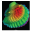

.. |item-1dim| image:: ../../../../silx/resources/gui/icons/item-1dim.png
.. |item-2dim| image:: ../../../../silx/resources/gui/icons/item-2dim.png
.. |item-3dim| image:: ../../../../silx/resources/gui/icons/item-3dim.png

.. |item-object| image:: ../../../../silx/resources/gui/icons/item-object.png

.. |math-average| image:: ../../../../silx/resources/gui/icons/math-average.png
.. |math-derive| image:: ../../../../silx/resources/gui/icons/math-derive.png

.. |math-fit| image:: ../../../../silx/resources/gui/icons/math-fit.png

.. |math-normalize| image:: ../../../../silx/resources/gui/icons/math-normalize.png
.. |math-peak-reset| image:: ../../../../silx/resources/gui/icons/math-peak-reset.png
.. |math-peak-search| image:: ../../../../silx/resources/gui/icons/math-peak-search.png
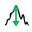

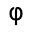

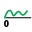

.. |next| image:: ../../../../silx/resources/gui/icons/next.png

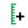

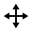

.. |plot-grid| image:: ../../../../silx/resources/gui/icons/plot-grid.png

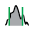

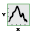
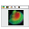
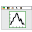
.. |plot-xauto| image:: ../../../../silx/resources/gui/icons/plot-xauto.png
.. |plot-xlog| image:: ../../../../silx/resources/gui/icons/plot-xlog.png
.. |plot-yauto| image:: ../../../../silx/resources/gui/icons/plot-yauto.png
.. |plot-ydown| image:: ../../../../silx/resources/gui/icons/plot-ydown.png
.. |plot-ylog| image:: ../../../../silx/resources/gui/icons/plot-ylog.png

.. |previous| image:: ../../../../silx/resources/gui/icons/previous.png
.. |profile-clear| image:: ../../../../silx/resources/gui/icons/profile-clear.png
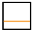
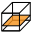
.. |remove| image:: ../../../../silx/resources/gui/icons/remove.png
.. |rotate-3d| image:: ../../../../silx/resources/gui/icons/rotate-3d.png
.. |rudder| image:: ../../../../silx/resources/gui/icons/rudder.png

.. |shape-circle-solid| image:: ../../../../silx/resources/gui/icons/shape-circle-solid.png

.. |shape-rectangle| image:: ../../../../silx/resources/gui/icons/shape-rectangle.png

.. |silx| image:: ../../../../silx/resources/gui/icons/silx.png
.. |sliders-off| image:: ../../../../silx/resources/gui/icons/sliders-off.png

.. |view-1d| image:: ../../../../silx/resources/gui/icons/view-1d.png

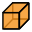
.. |view-fullscreen| image:: ../../../../silx/resources/gui/icons/view-fullscreen.png

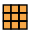
.. |view-refresh| image:: ../../../../silx/resources/gui/icons/view-refresh.png

.. |window-new| image:: ../../../../silx/resources/gui/icons/window-new.png
.. |zoom-back| image:: ../../../../silx/resources/gui/icons/zoom-back.png

.. |zoom-original| image:: ../../../../silx/resources/gui/icons/zoom-original.png
.. |zoom-out| image:: ../../../../silx/resources/gui/icons/zoom-out.png

