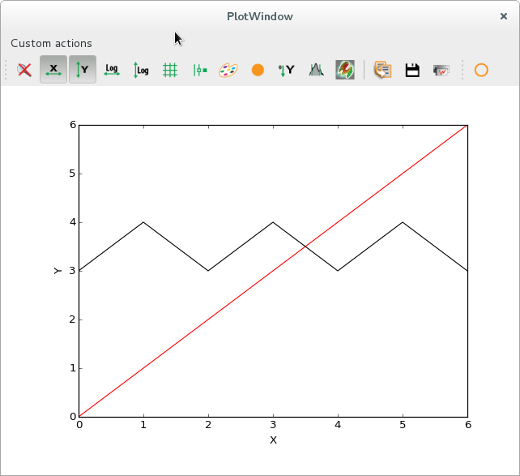
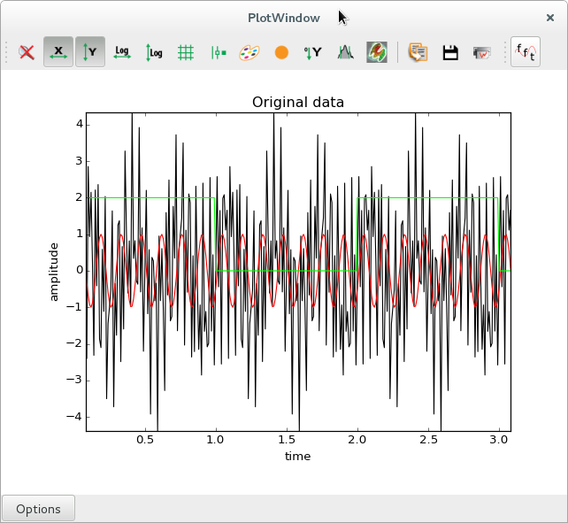

.. currentmodule:: silx.gui

Adding custom plot actions
==========================

:class:`PlotWindow` defines a number of standard plot actions that can be executed
by clicking on toolbar icons.

Developers can design additional plot actions to be added as toolbar icons or as menu entries,
to be added to a :class:`PlotWindow` or to design their own plot window based on
:class:`PlotWidget`.

This documentation pages provide examples on how to do this.

Simple example: Shift a curve
-----------------------------

The following script is a simplistic example to show the required basic steps:

 - create a new class inheriting from :class:`silx.gui.plot.actions.PlotAction`
 - define basic parameters such as the icon, the tooltip...
 - write a method that will be triggered by the plot action
 - initialise the new plot action by passing a reference to a plot window
 - add the plot action to a toolbar or a menu

The method implemented in this action interacts with the plot in a basic way. It gets the active curve,
then it creates a new data array based on the curve points, and finally it replaces the original curve
by a new one using the modified data array.

.. literalinclude:: ../../../../../../examples/shiftPlotAction.py
   :lines: 36-

.. |imgShiftAction0| image:: img/shiftAction0.png
   :height: 300px
   :align: middle

.. list-table::
   :widths: 1 2

   * - |imgShiftAction0|
     - Initial state
   * - |imgShiftAction3|
     - After triggering the action 3 times, the selected triangle shaped curve
       is shifted up by 3 units

Advanced example: Display an amplitude spectrum
-----------------------------------------------

This more advanced example (see `figure below`_) shows additional ways of interacting with the plot, by changing
labels, storing additional data arrays along with the curve coordinates.

This action is *checkable*, meaning that is has two states. When clicking the toolbar icon
or the menu item, this remains in a *pushed* state until it is clicked again.

In one state (*un-checked*), the original data is displayed. In the other state, the amplitude
spectrum of the original signal is displayed. When the state is changed, the triggered action
computes either the Fast Fourier Transform (FFT), or the reverse FFT.

This example also illustrates how to store additional data along with a curve.
The FFT computation returns complex values, but you want to display real data, so you compute
the spectrum of amplitudes. However, the inverse FFT requires the complete FFT data as input.
You are therefore required to store the complex array of FFT data as curve metadata,
in order to be able to reverse the process when the action is unchecked.

.. literalinclude:: ../../../../../../examples/fftPlotAction.py
   :lines: 44-

.. |imgFftAction1| image:: img/fftAction1.png
   :height: 300px
   :align: middle

.. _`figure below`:

.. list-table::
   :widths: 1 2

   * - |imgFftAction0|
     - Original signals (zoomed in). In red, a cosine wave at 7 Hz.
       In black, a sum of sines with frequencies of 3, 20 and 42 Hz.
       In green, a square wave with a fundamental frequency of 0.5 Hz
       (period of 2 seconds).
   * - |imgFftAction1|
     - Amplitude spectra (zoomed in), with peaks visible at
       the expected frequencies of 3, 7, 20 and 42 Hz for the sine and cosine
       signals, respectively. In green, one sees the complete series of peaks related to the square wave,
       with a fundamental frequency at 0.5 Hz and harmonic frequencies at every
       odd multiple of the fundamental frequency.
