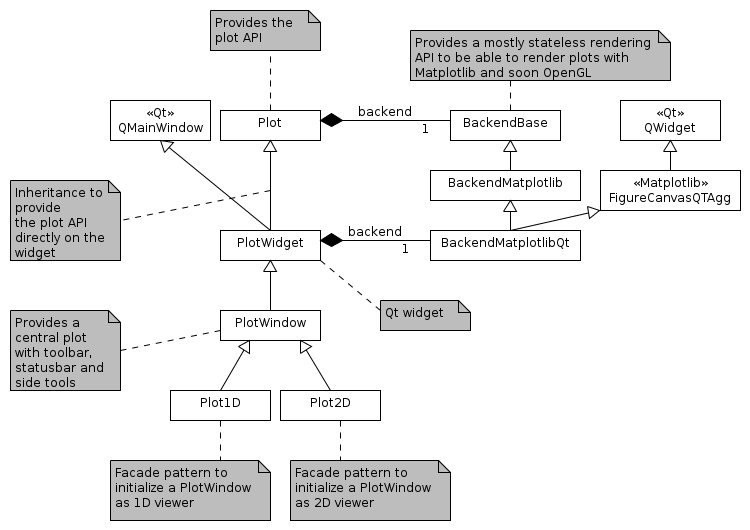

Package structure
=================

The :mod:`silx.gui.plot` package provides plot widgets.
This package is structured as follows.

.. currentmodule:: silx.gui.plot

:mod:`.PlotWidget` and :mod:`.PlotWindow` provides the user API.
:class:`PlotWidget` is a Qt widget (actually a :class:`QMainWindow`) displaying a 1D, 2D plot area.
It provides different interaction modes.
:class:`PlotWindow` is a Qt widget (actually a :class:`QMainWindow`) which adds a set of toolbar buttons and associated functionalities to :class:`PlotWidget`.
The toolbar QActions are implemented in :mod:`.actions`.

:mod:`.Plot`, :mod:`.PlotEvents` and :mod:`.PlotInteraction` implement the plotting API regardless of the rendering backend and regardless of its integration in Qt.
The plotting API in defined in :mod:`.Plot`.
The different interaction modes (zoom, drawing, pan) are implemented in :mod:`.PlotInteraction`.
Each interaction mode is implemented with a state machine structure (implemented in :mod:`.Interaction`).
The different events emitted by :class:`Plot` and by the interaction modes are created with helper functions defined in :mod:`.PlotEvents`.

The :class:`PlotWindow` uses additional widgets:

- :mod:`.CurvesROIWidget` to create regions of interest for curves
- :mod:`.LegendSelector` to display a list of curves legends which provides some control on the curves (e.g., select, delete).
- :mod:`.MaskToolsWidget` to provide tools to draw a mask on an image.
- :mod:`.ScatterMaskToolsWidget` to provide tools to draw a mask on a scatter.
- The :mod:`.PlotTools` module provides a set of additional widgets:

  - :class:`.PlotTools.PositionInfo`
  - :class:`.PlotTools.LimitsToolBar`

- The :mod:`.Profile` module provides toolbar for extracting profiles from image and image stack:

  - :class:`.Profile.ProfileToolBar`
  - :class:`.Profile.Profile3DToolBar`

- :mod:`silx.gui.console` to provide an IPython console which can control the plot area content.

The widgets also use the following miscellaneous modules:

- :mod:`._utils`: utility functions

The :mod:`backends` package provide the implementation of the rendering used by the :class:`Plot`.
It contains:
:mod:`.backends.BackendBase` defines the API any plot backend should provide in :class:`BackendBase`.
:mod:`.backends.BackendMatplotlib` implements a `matplotlib <http://matplotlib.org/>`_ backend.
The :mod:`.backends.BackendMatplotlib` the provides two classes:

.. currentmodule:: silx.gui.plot.backends.BackendMatplotlib

- :class:`BackendMatplotlib` that provides a matplotlib backend without a specific canvas.
- :class:`BackendMatplotlibQt` which inherits from :class:`BackendMatplotlib` and adds a Qt canvas, and Qt specific functionalities.

The OpenGL-based backend is implemented in the :mod:`.backends.BackendOpenGL` module and
the :mod:`.backends.glutils` package which provides the different primitives used for rendering and interaction.
It is based on :mod:`silx.gui._glutils`, `PyOpenGL <http://pyopengl.sourceforge.net/>`_ and OpenGL >= 2.1.

|Plot and backend|

Modules
=======

.. currentmodule:: silx.gui.plot

For :mod:`.PlotWidget` and :mod:`.Plot` modules, see their respective documentations: :mod:`.PlotWidget`, :mod:`.Plot`.

The following modules are the modules used internally by the plot package.

:mod:`backends.BackendBase`
+++++++++++++++++++++++++++

.. currentmodule:: silx.gui.plot.backends.BackendBase

.. automodule:: silx.gui.plot.backends.BackendBase
   :members:

:mod:`backends.BackendMatplotlib`
+++++++++++++++++++++++++++++++++

.. currentmodule:: silx.gui.plot.backends.BackendMatplotlib

.. automodule:: silx.gui.plot.backends.BackendMatplotlib
   :members:

:mod:`CurvesROIWidget`
++++++++++++++++++++++

.. currentmodule:: silx.gui.plot.CurvesROIWidget

.. automodule:: silx.gui.plot.CurvesROIWidget
   :members:
   :noindex:

:mod:`Interaction`
++++++++++++++++++

.. currentmodule:: silx.gui.plot.Interaction

.. automodule:: silx.gui.plot.Interaction
   :members:

:mod:`LegendSelector`
+++++++++++++++++++++

.. currentmodule:: silx.gui.plot.LegendSelector

.. automodule:: silx.gui.plot.LegendSelector
   :members:

:mod:`_BaseMaskToolsWidget`
+++++++++++++++++++++++++++

.. currentmodule:: silx.gui.plot._BaseMaskToolsWidget

.. automodule:: silx.gui.plot._BaseMaskToolsWidget
   :members:

:mod:`MaskToolsWidget`
++++++++++++++++++++++

.. currentmodule:: silx.gui.plot.MaskToolsWidget

.. automodule:: silx.gui.plot.MaskToolsWidget
   :members:
   :show-inheritance:

:mod:`ScatterMaskToolsWidget`
+++++++++++++++++++++++++++++

.. currentmodule:: silx.gui.plot.ScatterMaskToolsWidget

.. automodule:: silx.gui.plot.ScatterMaskToolsWidget
   :members:
   :show-inheritance:

:mod:`PlotEvents`
+++++++++++++++++

.. currentmodule:: silx.gui.plot.PlotEvents

.. automodule:: silx.gui.plot.PlotEvents
   :members:
   :undoc-members:

:mod:`PlotInteraction`
++++++++++++++++++++++

.. currentmodule:: silx.gui.plot.PlotInteraction

.. automodule:: silx.gui.plot.PlotInteraction
   :members:

:mod:`_utils`
+++++++++++++

.. currentmodule:: silx.gui.plot._utils

.. automodule:: silx.gui.plot._utils
   :members:

:mod:`ticklayout`
-----------------

.. automodule:: silx.gui.plot._utils.ticklayout
   :members: