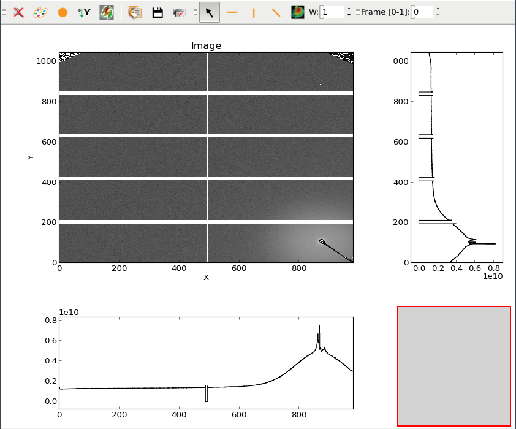

.. currentmodule:: silx.gui.plot

:mod:`ImageView`: Plot an image with side histograms
====================================================

.. automodule:: silx.gui.plot.ImageView

:class:`ImageView` class
------------------------

.. autoclass:: ImageView
   :members: valueChanged, setImage, getColormap, setColormap, getHistogram, setGraphTitle, getXAxis, getYAxis
