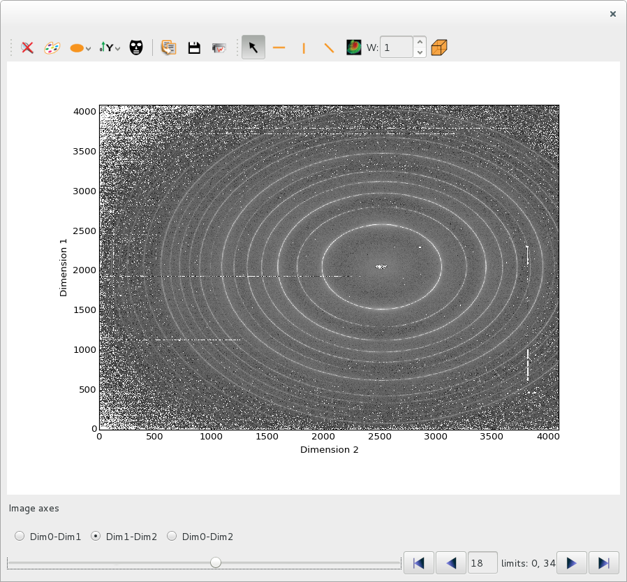
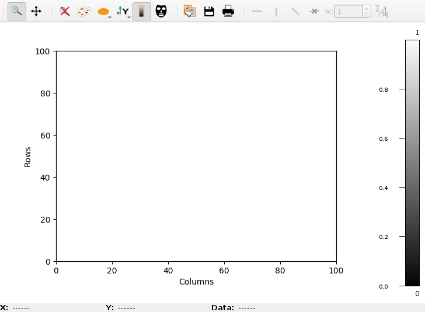

.. currentmodule:: silx.gui

:mod:`plot`: 1D and 2D Plot widgets
===================================

.. toctree::
   :hidden:

   getting_started.rst

.. currentmodule:: silx.gui.plot

.. automodule:: silx.gui.plot

For an introduction to the widgets of this package, see :doc:`getting_started`.

For examples of custom plot actions, see :doc:`plotactions_examples`.

Widgets gallery
---------------

The :mod:`silx.gui.plot` package provides the following plotting widgets:

.. |imgPlotWidget| image:: img/PlotWidget.png
   :height: 150px
   :align: middle

.. |imgPlotWindow| image:: img/PlotWindow.png
   :height: 150px
   :align: middle

.. |imgPlot1D| image:: img/Plot1D.png
   :height: 150px
   :align: middle

.. |imgPlot2D| image:: img/Plot2D.png
   :height: 150px
   :align: middle

.. |imgImageView| image:: img/ImageView.png
   :height: 150px
   :align: middle

.. list-table::
   :widths: 1 4
   :header-rows: 1

   * - Widget
     - Description
   * - |imgPlotWidget|
     - :class:`PlotWidget` is the base Qt widget providing a plot area.
       Other plot widgets are based on this one and provides the same API.
   * - |imgPlotWindow|
     - :class:`PlotWindow` adds a toolbar to :class:`PlotWidget`.
       The content of this toolbar can be configured from the
       :class:`PlotWindow` constructor or by hiding its content afterward.
   * - |imgPlot1D|
     - :class:`.Plot1D` is a :class:`PlotWindow` configured with tools useful
       for curves.
   * - |imgPlot2D|
     - :class:`.Plot2D` is a :class:`PlotWindow` configured with tools useful
       for images.
   * - |imgImageView|
     - :class:`ImageView` adds side histograms to a :class:`.Plot2D` widget.
   * - |imgStackView|
     - :class:`StackView` is a widget designed to display an image from a
       stack of images in a :class:`PlotWindow` widget, with a frame browser
       to navigate in the stack. The profile tool can do a 2D profile on the
       stack of images.

It also provides (and uses) widgets that can be attached to a :class:`PlotWidget`:

.. list-table::
   :widths: 1 4
   :header-rows: 1

   * - Widget
     - Description
   * - |imgPositionInfo|
     - :class:`.PlotTools.PositionInfo` is a widget displaying mouse position and
       information of a :class:`PlotWidget` associated to the mouse position.
   * - |imgLimitsToolBar|
     - :class:`.PlotTools.LimitsToolBar` is a QToolBar displaying and
       controlling the limits of a :class:`PlotWidget`.

Public modules
--------------

.. toctree::
   :maxdepth: 2

   plotwidget.rst
   plotwindow.rst
   imageview.rst
   stackview.rst
   plot.rst
   plotactions.rst
   plottools.rst
   profile.rst
   roi.rst

Internals
---------

.. toctree::
   :maxdepth: 2

   dev.rst
