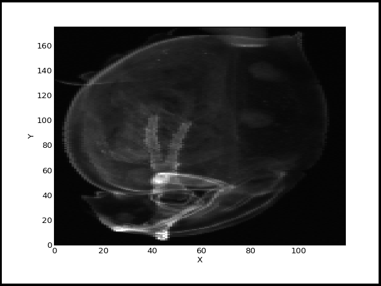
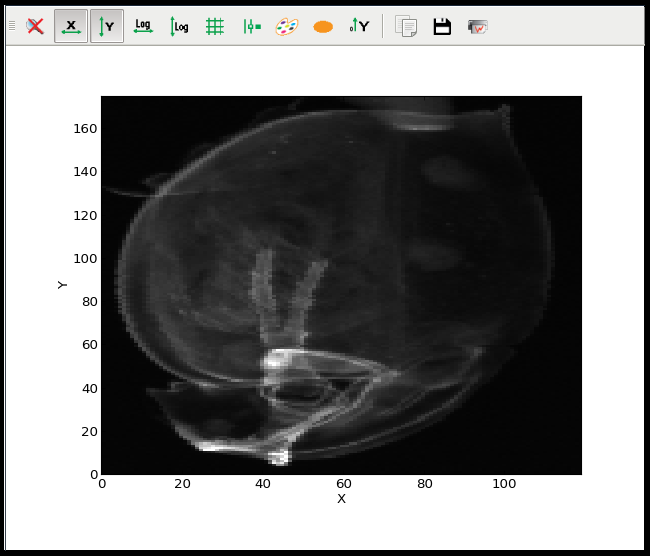

.. currentmodule:: silx.gui

:mod:`plot`: 1D and 2D Plot widgets
-----------------------------------

.. toctree::
   :hidden:

   getting_started.rst

For an introduction to the widgets of this module, see :doc:`getting_started`.

.. currentmodule:: silx.gui.plot

.. automodule:: silx.gui.plot

Snapshot of the widgets:

=================== ===================
|imgPlotWidget|     |imgPlotWindow|
:class:`PlotWidget` :class:`PlotWindow`
=================== ===================

Public modules:

.. toctree::
   :maxdepth: 2

   plot.rst
   plotwidget.rst
   plotwindow.rst
   imageview.rst

Internals:

.. toctree::
   :maxdepth: 2

   dev.rst
