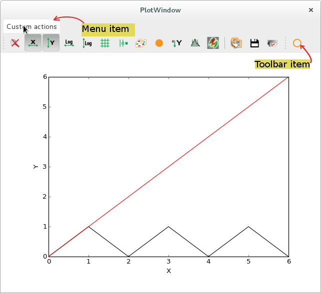
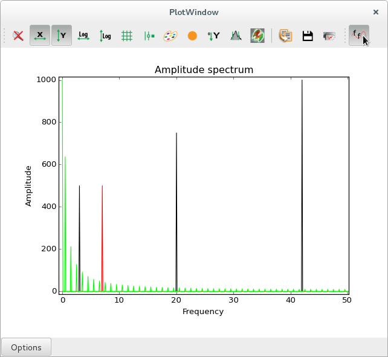

.. currentmodule:: silx.gui

Adding custom plot actions
==========================

A :class:`PlotWindow` defines a number of standard plot actions that can be executed
by clicking on toolbar icons.

Developers can design additional plot actions to be added as toolbar icons or as menu entries,
to be added to a :class:`PlotWindow` or to design their own plot window based on
:class:`PlotWidget`.

This documentation pages provides examples on how to do this.

Simple example
--------------

The following script is a simplistic example to show the basic required steps:

 - create a new class inheriting from :class:`silx.gui.plot.PlotActions.PlotAction`
 - define basic parameters such as the icon, the tooltip...
 - write a method that will be triggered by the action
 - initialize the new plot action by passing a reference to a plot window
 - add the action to a toolbar or a menu

The method implemented in this action interacts with the plot in a basic way. It gets the active curve,
then it creates a new data array based on the curve data, and finally it replaces the original curve
with a new one using the modified data array.

.. code-block:: python

   from silx.gui import qt
   from silx.gui.plot import PlotWindow
   from silx.gui.plot.PlotActions import PlotAction

   class ShiftUpAction(PlotAction):
       """QAction shifting up a curve by one unit

       :param plot: :class:`.PlotWidget` instance on which to operate
       :param parent: See :class:`QAction`
       """
       def __init__(self, plot, parent=None):
           PlotAction.__init__(self,
                               plot,
                               icon='shape-circle',
                               text='Shift up',
                               tooltip='Shift active curve up by one unit',
                               triggered=self.shiftActiveCurveUp,
                               parent=parent)

       def shiftActiveCurveUp(self):
           """Get the active curve, add 1 to all y values, use this new y
           array to replace the original curve
           """
           activeCurve = self.plot.getActiveCurve()
           if activeCurve is not None:
               # Unpack curve data.
               # Each curve is represented by a tuple of 5 variables:
               #  - x and y are the array of abscissa and ordinate values
               #  - legend is a unique text identifying a curve
               #  - info and params are dictionaries of additional data
               #    (user defined, curve style and color...)
               x0, y0, legend, info, params = activeCurve

               # add 1 to all values in the y array
               # and assign the result to a new array y1
               # (IMPORTANT: do not modify y0 directly)
               y1 = y0 + 1.0

               # Re-using the same legend causes the original curve
               # to be replaced
               self.plot.addCurve(x0, y1, legend=legend,
                                  info=info)

   # creating QApplication is mandatory in order to use qt widget
   app = qt.QApplication([])

   # create a PlotWindow
   plotwin = PlotWindow()
   # Add a new toolbar
   toolbar = qt.QToolBar("My toolbar")
   plotwin.addToolBar(toolbar)
   # Get a reference to the PlotWindow's menu bar, add a menu
   menubar = plotwin.menuBar()
   actions_menu = menubar.addMenu("Custom actions")

   # Initialize our action, give it plotwin as a parameter
   myaction = ShiftUpAction(plotwin)
   # Add action to the menubar and toolbar
   toolbar.addAction(myaction)
   actions_menu.addAction(myaction)

   # Plot a couple of curves with synthetic data
   x = [0, 1, 2, 3, 4, 5, 6]
   y1 = [0, 1, 0, 1, 0, 1, 0]
   y2 = [0, 1, 2, 3, 4, 5, 6]
   plotwin.addCurve(x, y1, legend="triangle shaped curve")
   plotwin.addCurve(x, y2, legend="oblique line")

   plotwin.show()
   app.exec_()

.. |imgShiftAction3| image:: img/shiftAction3.png
   :height: 300px
   :align: middle

.. list-table::
   :widths: 1 2

   * - |imgShiftAction0|
     - Initial state
   * - |imgShiftAction3|
     - After triggering the action 3 times, the selected triangle shaped curve
       is shifted up by 3 units

Advanced example
----------------

This more advanced example shows additional ways of interacting with the plot, by changing
labels, storing additional data array along with the curve data.

This action is *checkable*, meaning that is has two stable states. When clicking the toolbar icon
or the menu item, it remains in a *pushed* state until it is clicked again.

In one state (*un-checked*), the original data is displayed. In the other state, the amplitude
spectrum of the original signal is displayed. When the state is changed, the triggered action
computes either the Fast Fourier Transform (FFT), or the reverse FFT.

This example also illustrates how to store additional data, along with a curve.
The FFT computation returns complex values, but we want to display real data, so we compute
the amplitude spectrum. However, the inverse FFT requires  the complete FFT data as input.
We are therefore, required to store the complex array of FFT data as curve metadata,
in order to be able to reverse the process when the action is unchecked.

.. code-block:: python

   import numpy
   import os

   from silx.gui import qt
   from silx.gui.plot import PlotWindow
   from silx.gui.plot.PlotActions import PlotAction

   # Custom icon
   # make sure there is a "fft.png" file saved in the same folder as this script
   scriptdir = os.path.dirname(os.path.realpath(__file__))
   my_icon = os.path.join(scriptdir, "fft.png")

   class FftAction(PlotAction):
       """QAction performing a Fourier transform on all curves when checked,
       and reverse transform when unchecked.

       :param plot: PlotWindow on which to operate
       :param parent: See documentation of :class:`QAction`
       """
       def __init__(self, plot, parent=None):
           PlotAction.__init__(
                   self,
                   plot,
                   icon=qt.QIcon(my_icon),
                   text='FFT',
                   tooltip='Perform Fast Fourier Transform on all curves',
                   triggered=self.fftAllCurves,
                   checkable=True,
                   parent=parent)

       def _rememberGraphLabels(self):
           """Store labels and title as attributes"""
           self.original_title = self.plot.getGraphTitle()
           self.original_xlabel = self.plot.getGraphXLabel()
           self.original_ylabel = self.plot.getGraphYLabel()

       def fftAllCurves(self, checked=False):
           """Get all curves from our PlotWindow, compute the amplitude spectrum
           using a Fast Fourier Transform, replace all curves with their
           amplitude spectra.

           When un-checking the button, do the reverse transform.

           :param checked: Boolean parameter signaling whether the action
               has been checked or unchecked.
           """
           allCurves = self.plot.getAllCurves(withhidden=True)

           if checked:
               # remember original labels
               self._rememberGraphLabels()
               # change them
               self.plot.setGraphTitle("Amplitude spectrum")
               self.plot.setGraphXLabel("Frequency")
               self.plot.setGraphYLabel("Amplitude")
           else:
               # restore original labels
               self.plot.setGraphTitle(self.original_title)
               self.plot.setGraphXLabel(self.original_xlabel)
               self.plot.setGraphYLabel(self.original_ylabel)

           self.plot.clearCurves()

           for i, curve in enumerate(allCurves):
               x, y, legend, info, params = curve

               if checked:
                   # FAST FOURIER TRANSFORM
                   fft_y = numpy.fft.fft(y)
                   # amplitude spectrum
                   A = numpy.abs(fft_y)

                   # sampling frequency (samples per X unit)
                   Fs = len(x) / (max(x) - min(x))
                   # frequency array (abscissa of new curve)
                   F = [k * Fs / len(x) for k in range(len(A))]

                   # we need to store  the complete transform (complex data) to be
                   # able to perform the reverse transform.
                   info["complex fft"] = fft_y
                   info["original x"] = x

                   # plot the amplitude spectrum
                   self.plot.addCurve(F, A, legend="FFT of " + legend,
                                      info=info)

               else:
                   # INVERSE FFT
                   fft_y = info["complex fft"]
                   # we keep only the real part because we know the imaginary
                   # part is 0 (our original data was real numbers)
                   y1 = numpy.real(numpy.fft.ifft(fft_y))

                   # recover original info
                   x1 = info["original x"]
                   legend1 = legend[7:]    # remove "FFT of "

                   # remove restored data from info dict
                   for key in ["complex fft", "original x"]:
                       del info[key]

                   # plot the original data
                   self.plot.addCurve(x1, y1, legend=legend1,
                                      info=info)

           self.plot.resetZoom()

   app = qt.QApplication([])

   plotwin = PlotWindow(control=True)
   toolbar = qt.QToolBar("My toolbar")
   plotwin.addToolBar(toolbar)

   myaction = FftAction(plotwin)
   toolbar.addAction(myaction)

   # x range: 0 -- 10 (1000 points)
   x = numpy.arange(1000) * 0.01

   twopi = 2 * numpy.pi
   # Sum of sine functions with frequencies 3, 20 and 42 Hz
   y1 = numpy.sin(twopi * 3 * x) + 1.5 * numpy.sin(twopi * 20 * x) + \
        2 * numpy.sin(twopi * 42 * x)
   # Cosine with frequency 7 Hz and phase pi / 3
   y2 = numpy.cos(twopi * 7 * (x - numpy.pi / 3))
   # 5 periods of square wave, amplitude 2
   y3 = numpy.zeros_like(x)
   for i in [0, 2, 4, 6, 8]:
       y3[i * len(x) / 10:(i + 1) * len(x) / 10] = 2

   plotwin.addCurve(x, y1, legend="sin")
   plotwin.addCurve(x, y2, legend="cos")
   plotwin.addCurve(x, y3, legend="square wave")

   plotwin.setGraphTitle("Original data")
   plotwin.setGraphYLabel("amplitude")
   plotwin.setGraphXLabel("time")

   plotwin.show()
   app.exec_()

.. |imgFftAction0| image:: img/fftAction0.png
   :height: 300px
   :align: middle

.. list-table::
   :widths: 1 2

   * - |imgFftAction0|
     - Original signals (zoom applied). In red, a cosine wave at 7 Hz.
       In black, a sum of sines with frequencies of 3, 20 and 42 Hz.
       In green, a square wave with a fundamental frequency of 0.5 Hz
       (wavelength of 2 seconds).
   * - |imgFftAction1|
     - Amplitude spectra (zoom applied), with peaks visible at
       the expected frequencies of 3, 7, 20 and 42 Hz for the sine and cosine
       signals. In green, we see the complete series of peaks related to the square wave,
       with a fundamental frequency at 0.5 Hz and harmonic frequencies at every
       odd multiple of the fundamental.
