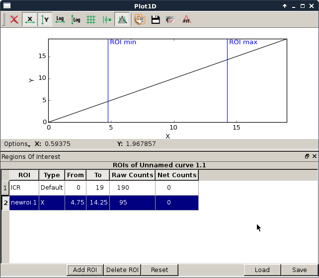

.. currentmodule:: silx.gui.plot.CurvesROIWidget

:mod:`CurvesROIWidget`: ROI from curves
=======================================

.. automodule:: silx.gui.plot.CurvesROIWidget

You can access to the ROIWidget from a Plot window by :

- using the tool button 'ROI'
- using the options button then by selecting region of interest.

|roiWidgetImage|

:class:`ROI` class
------------------

.. autoclass:: ROI
   :show-inheritance:
   :members:

:class:`CurvesROIWidget` class
-------------------------------

.. autoclass:: CurvesROIWidget
   :show-inheritance:
   :members:

:class:`ROITable` class
-----------------------

.. autoclass:: ROITable
   :show-inheritance:
   :members:
