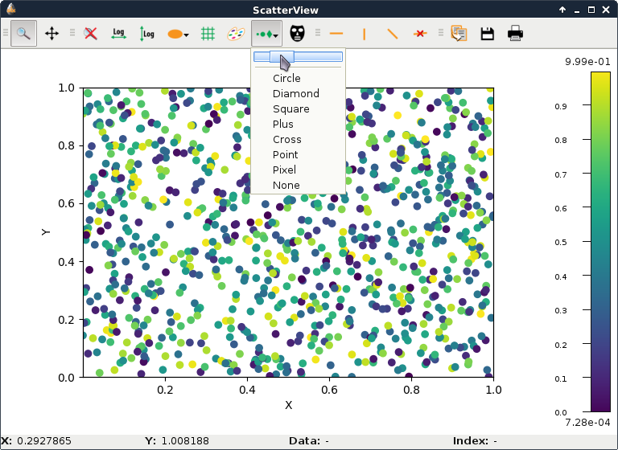

.. currentmodule:: silx.gui.plot

:mod:`ScatterView`: Plot 2D scatter data
========================================

.. automodule:: silx.gui.plot.ScatterView

.. currentmodule:: silx.gui.plot.ScatterView

:class:`ScatterView` class
--------------------------

.. autoclass:: ScatterView
   :show-inheritance:
   :members: