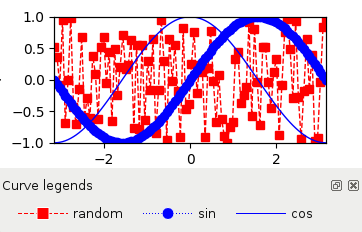

:mod:`~silx.gui.plot.tools`: Tool widgets for PlotWidget
========================================================

.. currentmodule:: silx.gui.plot.tools

.. automodule:: silx.gui.plot.tools

:class:`PositionInfo` class
---------------------------

.. autoclass:: PositionInfo
   :show-inheritance:
   :members:

:class:`LimitsToolBar` class
----------------------------

.. autoclass:: LimitsToolBar
   :show-inheritance:
   :members:

:class:`InteractiveModeToolBar` class
-------------------------------------

.. autoclass:: InteractiveModeToolBar
   :show-inheritance:
   :members:

:class:`OutputToolBar` class
----------------------------

.. autoclass:: OutputToolBar
   :show-inheritance:
   :members:

:class:`ImageToolBar` class
----------------------------

.. autoclass:: ImageToolBar
   :show-inheritance:
   :members:

:class:`CurveToolBar` class
----------------------------

.. autoclass:: CurveToolBar
   :show-inheritance:
   :members:

:class:`ScatterToolBar` class
-----------------------------

.. autoclass:: ScatterToolBar
   :show-inheritance:
   :members:

:mod:`~silx.gui.plot.tools.CurveLegendsWidget`
----------------------------------------------

.. automodule:: silx.gui.plot.tools.CurveLegendsWidget

.. autoclass:: silx.gui.plot.tools.CurveLegendsWidget.CurveLegendsWidget
   :show-inheritance:
   :members:

:mod:`~silx.gui.plot.tools.roi`: Region of interest
---------------------------------------------------

.. automodule:: silx.gui.plot.tools.roi

.. currentmodule:: silx.gui.plot.tools.roi

:class:`RegionOfInterestManager` class
++++++++++++++++++++++++++++++++++++++

.. autoclass:: RegionOfInterestManager
   :members:

:class:`InteractiveRegionOfInterestManager` class
+++++++++++++++++++++++++++++++++++++++++++++++++

.. autoclass:: InteractiveRegionOfInterestManager
   :members:

:class:`RegionOfInterestTableWidget` class
++++++++++++++++++++++++++++++++++++++++++

.. autoclass:: RegionOfInterestTableWidget
   :members:

:mod:`~silx.gui.plot.tools.profile`: Profile Tools
--------------------------------------------------

.. automodule:: silx.gui.plot.tools.profile

.. currentmodule:: silx.gui.plot.tools.profile

:class:`ScatterProfileToolBar`
++++++++++++++++++++++++++++++

.. autoclass:: ScatterProfileToolBar
   :members: sigProfileChanged, getProfilePoints, getProfileValues, getProfileTitle, getPlotWidget, isDefaultProfileWindowEnabled, setDefaultProfileWindowEnabled, getDefaultProfileWindow, getColor, setColor, clearProfile, getNPoints, setNPoints

.. currentmodule:: silx.gui.plot

:mod:`ColorBar`: ColorBar Widget
================================

.. currentmodule:: silx.gui.plot.ColorBar

.. automodule:: silx.gui.plot.ColorBar

:class:`ColorBarWidget` class
-----------------------------

.. autoclass:: ColorBarWidget
   :members:
