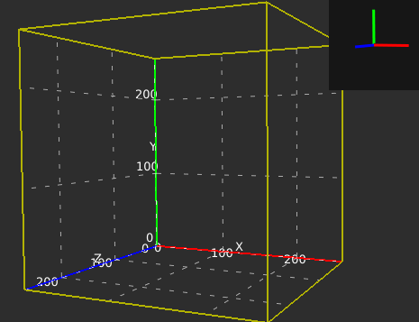
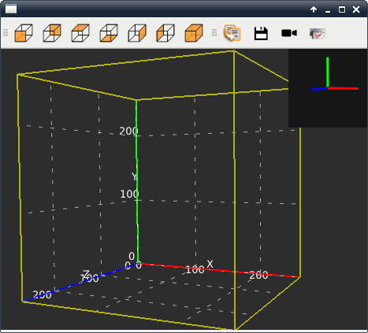
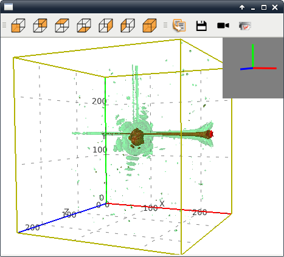

.. currentmodule:: silx.gui

:mod:`plot3d`: 3D Visualisation widgets
=======================================

.. currentmodule:: silx.gui.plot3d

.. automodule:: silx.gui.plot3d

Widgets gallery
---------------

.. list-table::
   :widths: 1 4
   :header-rows: 1

   * - Widget
     - Description
   * - |imgPlot3DWidget|
     - :class:`Plot3DWidget` is the base Qt widget providing an OpenGL 3D scene.
       Other widgets are using this widget as the OpenGL scene canvas.
   * - |imgPlot3DWindow|
     - :class:`Plot3DWindow` is a QMainWindow with a :class:`Plot3DWidget` as central widget
       and a toolbar.
   * - |imgScalarFieldView|
     - :class:`ScalarFieldView` is a :class:`Plot3DWindow` dedicated to display 3D scalar field.
       It can display iso-surfaces and an interactive cutting plane.

Public modules
--------------

.. toctree::
   :maxdepth: 2

   plot3dwidget.rst
   plot3dwindow.rst
   scalarfieldview.rst

Sample code
-----------

- :doc:`viewer3dvolume_example`: Sample code using :class:`ScalarFieldView`

.. toctree::
   :hidden:

   viewer3dvolume_example.rst
