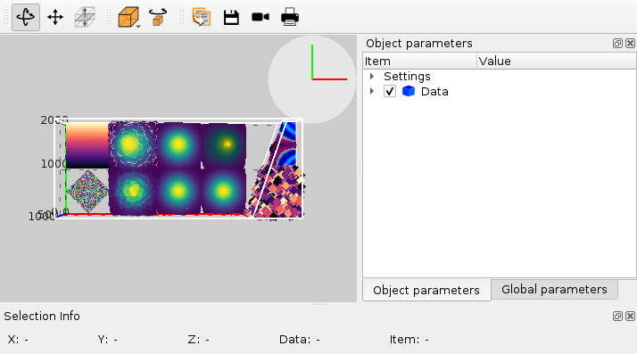

.. currentmodule:: silx.gui.plot3d

:mod:`SceneWidget`: 3D data viewer widget
=========================================

.. automodule:: silx.gui.plot3d.SceneWidget

For sample code using :class:`SceneWidget`, see ``plot3dSceneWindow.py`` in :ref:`plot3d-sample-code`.

.. currentmodule:: silx.gui.plot3d.SceneWidget

:class:`SceneWidget`
--------------------

.. autoclass:: SceneWidget
   :show-inheritance:
   :members:

:class:`SceneWidget` items
--------------------------

.. toctree::
   :maxdepth: 2

   items.rst

:class:`~silx.gui.plot3d.items._pick.PickingResult`
---------------------------------------------------

.. autoclass:: silx.gui.plot3d.items._pick.PickingResult
   :members: