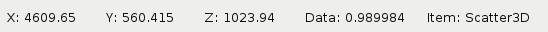
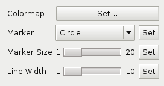

:mod:`tools`
============

.. currentmodule:: silx.gui.plot3d.tools

.. automodule:: silx.gui.plot3d.tools

Toolbars
--------

:class:`InteractiveModeToolbar`
+++++++++++++++++++++++++++++++

.. autoclass:: InteractiveModeToolBar
   :show-inheritance:
   :members:

:class:`OutputToolBar`
++++++++++++++++++++++

.. autoclass:: OutputToolBar
   :show-inheritance:
   :members:

:class:`ViewpointToolbar`
+++++++++++++++++++++++++

.. autoclass:: ViewpointToolBar
   :show-inheritance:
   :members:

Tool Buttons
------------

:class:`ViewpointToolButton`
++++++++++++++++++++++++++++

.. autoclass:: ViewpointToolButton
   :show-inheritance:
   :members:

Widgets
-------

:mod:`PositionInfoWidget`
+++++++++++++++++++++++++

.. automodule:: silx.gui.plot3d.tools.PositionInfoWidget

.. autoclass:: silx.gui.plot3d.tools.PositionInfoWidget.PositionInfoWidget
   :members:

:mod:`GroupPropertiesWidget`
++++++++++++++++++++++++++++

.. automodule:: silx.gui.plot3d.tools.GroupPropertiesWidget

.. autoclass:: silx.gui.plot3d.tools.GroupPropertiesWidget.GroupPropertiesWidget
   :members:
